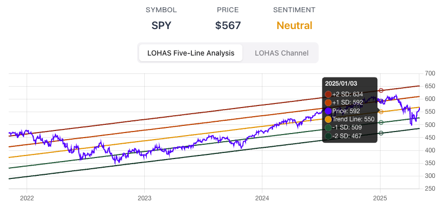
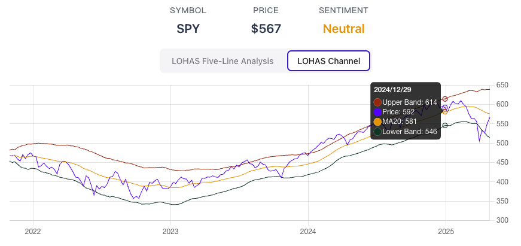
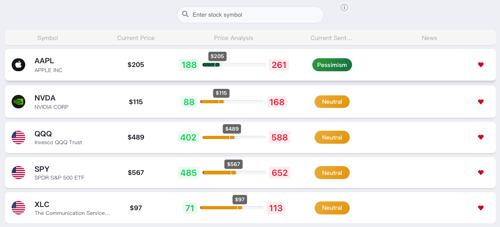

When SPY pulls back, is it a small dip or a substantial move away from its trend? **LOHAS Five-Line Analysis puts price in context. The LOHAS Channel then shows whether it has moved outside its recent range.**

Open [LOHAS Five-Line Analysis](/en/priceanalysis), enter SPY and select 3.5 years. Look at which two lines contain the price, then check the channel below. This guide walks through both charts.

## Table of Contents

1. [Using LOHAS Five-Line Analysis to Confirm Price Trends and Deviations](#using-lohas-five-line-analysis-to-confirm-price-trends-and-deviations)
2. [How to Interpret LOHAS Five-Line Analysis?](#how-to-interpret-lohas-five-line-analysis)
3. [How to Use the Lohas Channel for Assistance?](#how-to-use-the-lohas-channel-for-assistance)
4. [Using the Watchlist to Check LOHAS Levels for Multiple Stocks Simultaneously](#using-the-watchlist-to-check-lohas-levels-for-multiple-stocks-simultaneously)
5. [Combining Price, Sentiment and Fundamentals](#combining-price-sentiment-and-fundamentals)

## Using LOHAS Five-Line Analysis to Confirm Price Trends and Deviations

LOHAS Five-Line Analysis is based on the statistical concept of **mean reversion**. It assumes that, over the long term, a stock price tends to fluctuate around an average value. It uses **standard deviation** to draw five lines, helping us determine the current price's position relative to its long-term trend, thereby gauging the market's current level of optimism or pessimism towards that stock.

Importantly, LOHAS Five-Line Analysis works best when applied to an asset with a **stable upward trend**, such as Taiwanese index ETF 0050 or US index ETF SPY. These large index ETFs naturally benefit from economic progress and index rebalancing mechanisms, giving them inherent upward momentum. Avoid using this tool on stocks without a clear underlying upward trend.

The five lines of the LOHAS Five-Line Analysis are:
*   **The middle Trend Line:** A linear regression fitted to closing prices over the selected period, providing the baseline for measuring price deviation.
*   **Two Standard Deviation Lines Above and Below (TL+SD, TL+2SD, TL-SD, TL-2SD):** Calculated based on the statistical properties of price volatility, these lines represent the degree of deviation from the long-term trend.

## How to Interpret LOHAS Five-Line Analysis?

*   Price between the Trend Line and the first line above (TL+SD) or below (TL-SD): This is the **Neutral** zone. Holding existing positions is often considered appropriate here.

*   Price reaches the first line above (TL+SD): This signals **Greed**. Consider selling a portion of your holdings.
*   Price reaches the second line above (TL+2SD): This signals **Extreme Greed**. Price is well above its trend. Check whether the LOHAS Channel is also above its upper edge.
*   Price reaches the first line below (TL-SD): This signals **Fear**. Consider buying a portion.
*   Price reaches the second line below (TL-2SD): This signals **Extreme Fear**. Price is well below its trend. Check whether the LOHAS Channel is also below its lower edge.

> **Use the LOHAS Five-Line Analysis tool to help overcome your own fear and greed, preventing selling at the bottom and buying at the top.**

## How to Use the Lohas Channel for Assistance?

The LOHAS Five-Line chart shows how far price sits from its trend line, but price swings can be sharp. Investors naturally want to avoid "catching a falling knife" or "selling too early only to watch the stock soar". This is where the "**LOHAS Channel**" comes in as a complementary tool, helping to avoid premature buys or sells. It builds its edges from the highs and lows of the last 20 weeks, showing whether the current price has moved out of its recent range, as a second read on sentiment.

When price reaches Extreme Greed or Extreme Fear on the LOHAS Five-Line chart, look at the LOHAS Channel:
*   If the price breaks *above* the upper Lohas Channel line: Price has moved above its recent range, but the trend *might* continue. Consider holding.
*   If the price breaks *below* the lower Lohas Channel line: Price has moved below its recent range, but the trend *might* continue. Consider waiting.

When these situations occur, one strategy is to wait for the price to return *inside* the Lohas Channel before considering an action. However, this approach varies by individual strategy. Left-side traders might prefer to buy earlier ('catch the knife'), while right-side traders might wait for confirmation of a trend reversal. Your own risk tolerance matters, so adjust accordingly.

## Using the Watchlist to Check LOHAS Levels for Multiple Stocks Simultaneously

If you track multiple stocks and want to quickly check their current position on the LOHAS Five-Line scale, add them to your watchlist: [/en/watchlist](/en/watchlist). Stocks added to the list will automatically display their LOHAS Five-Line sentiment level, allowing for quick comparison. One way to use this is to track different sector ETFs, or compare growth (like QQQ) vs. value (like DIA), to observe how market sentiment flows between different areas.

## Combining Price, Sentiment and Fundamentals

I like Kostolányi’s owner-and-dog analogy: fundamentals are the owner, and price is the dog moving around them. Start with fundamentals to decide whether an asset is worth holding. Use the five-line chart to see how far its current price sits from the trend.

During a sell-off, check the data before joining the rush to sell. During a rally, check whether you are chasing. Reviewing different dates against the same baseline makes your decisions easier to examine.

**Try SPY or 0050 first, then add your investments to a Pro watchlist to compare their price levels in one place.** For a market-wide view, explore SIO’s eight sentiment signals next.

---

Next: [Using the SIO Fear & Greed Index to time buys and sells](/en/articles/using-market-sentiment-composite-index-to-time-buys-and-sells)

[See the latest reading for every market sentiment indicator](/en/sentiment-indicators)
