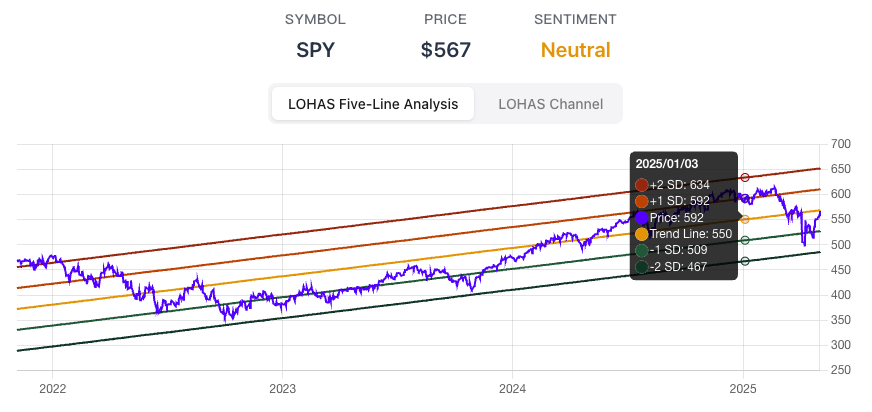
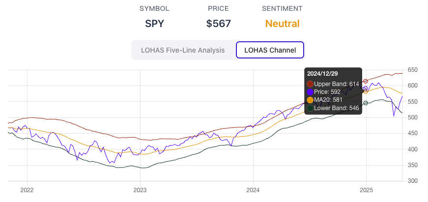
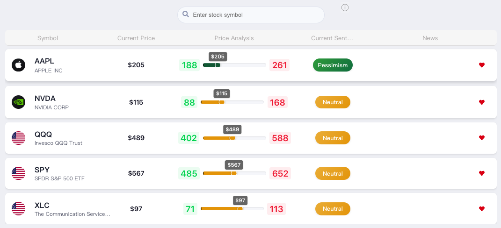

German stock market guru André Kostolányi famously said: "**Market = Funds + Psychology**." Funds encompass fundamentals like macroeconomics and company performance, while Psychology refers to investor sentiment – essentially, human nature. The up-and-down cycles in both the economy and stock prices stem from human irrationality. If everyone were rational, we'd likely see a steady, straight line upward with a fixed slope, not the peaks and valleys we observe in reality.

In the investment world, besides focusing on company fundamentals, "**Market Sentiment**" is a crucial indicator that shouldn't be ignored. It reflects investors' overall views and feelings about the market, acting like a stock market thermometer. It helps us judge whether the market is overheated or too cold, allowing us to make smarter investment decisions and avoid getting swept up in emotional waves.

## Table of Contents

1.  [What is Market Sentiment?](#what-is-market-sentiment)
2.  [Why is Market Sentiment So Important?](#why-is-market-sentiment-so-important)
3.  [Knowing Current Sentiment, Then What?](#knowing-current-sentiment-then-what)
4.  [So, Fundamental Analysis Isn't Important?](#so-fundamental-analysis-isnt-important)
5.  [Using LOHAS Five-Line Analysis to Confirm Price Trends and Deviations](#using-lohas-five-line-analysis-to-confirm-price-trends-and-deviations)
6.  [How to Interpret LOHAS Five-Line Analysis?](#how-to-interpret-lohas-five-line-analysis)
7.  [How to Use the Lohas Channel for Assistance?](#how-to-use-the-lohas-channel-for-assistance)
8.  [Using the Watchlist to Check LOHAS Levels for Multiple Stocks Simultaneously](#using-the-watchlist-to-check-lohas-levels-for-multiple-stocks-simultaneously)

## What is Market Sentiment?

Simply put, market sentiment is the overall feeling investors have about the market's future direction – it can be optimistic, pessimistic, or neutral. This collective mood directly influences investors' buying and selling behavior, which in turn drives stock price movements.

## Why is Market Sentiment So Important?

Market sentiment is a key turning point indicator. In a bear market, the moment the last investor turns pessimistic and sells or shorts the market – assuming no one more pessimistic appears – marks the peak of negative sentiment. This is often when the market begins to rise. Conversely, in a bull market, the moment the last investor turns optimistic and buys in – assuming no further buyers push prices higher – marks the peak of positive sentiment. This is often when the market starts to decline.

> **To avoid being that last investor selling at the bottom or buying at the top, you must be aware of whether you're just following the market's emotional swings.**

## Knowing Current Sentiment, Then What?

When you can gauge whether the market is currently overheated or too cold, you can make better investment decisions. When market sentiment is overly optimistic (Greed), it might signal a bubble and the risk of a price pullback. Conversely, when sentiment is overly pessimistic (Fear), it might present opportunities to buy low. This echoes Warren Buffett's famous saying: "**Be fearful when others are greedy, and greedy when others are fearful.**"

## So, Fundamental Analysis Isn't Important?

No, fundamental analysis is still crucial. However, stock prices don't just reflect a company's value; they also reflect emotions. Otherwise, why would they fluctuate so wildly day-to-day? A company's fundamentals certainly don't change that rapidly.

You can first use fundamentals to identify stocks with a steady upward trend (improving your odds), and then use market sentiment to help decide *when* to buy or sell. This aligns with Kostolányi's 'Man (Fundamentals) and Dog (Stock Price)' theory – the stock price (dog) runs around but ultimately stays close to its owner (fundamentals).

If you're unsure how to analyze fundamentals, the simplest approach is to choose large US index ETFs like SPY. As the long-term engine of the global economy, the US market (and thus SPY) has a generally stable upward trend over time, making it well-suited for LOHAS Five-Line Analysis.

## Using LOHAS Five-Line Analysis to Confirm Price Trends and Deviations

LOHAS Five-Line Analysis is based on the statistical concept of **mean reversion**. It assumes that, over the long term, a stock price tends to fluctuate around an average value. It uses **standard deviation** to draw five lines, helping us determine the current price's position relative to its long-term trend, thereby gauging the market's current level of optimism or pessimism towards that stock.

Importantly, LOHAS Five-Line Analysis works best when applied to an asset with a **stable upward trend**, such as Taiwanese index ETF 0050 or US index ETF SPY. These large index ETFs naturally benefit from economic progress and index rebalancing mechanisms, giving them inherent upward momentum. Avoid using this tool on stocks without a clear underlying upward trend.

The five lines of the LOHAS Five-Line Analysis are:
*   **The middle Trend Line:** Represents the long-term moving average of the stock price, serving as the baseline for assessing the long-term trend.
*   **Two Standard Deviation Lines Above and Below (TL+SD, TL+2SD, TL-SD, TL-2SD):** Calculated based on the statistical properties of price volatility, these lines represent the degree of deviation from the long-term trend.

## How to Interpret LOHAS Five-Line Analysis?

*   Price between the Trend Line and the first line above (TL+SD) or below (TL-SD): This is the **Neutral** zone. Holding existing positions is often considered appropriate here.

*   Price reaches the first line above (TL+SD): This signals **Optimism**. Consider selling a portion of your holdings.
*   Price reaches the second line above (TL+2SD): This signals **Extreme Optimism**. A significant further rise is less likely. Consider selling more holdings.
*   Price reaches the first line below (TL-SD): This signals **Pessimism**. Consider buying a portion.
*   Price reaches the second line below (TL-2SD): This signals **Extreme Pessimism**. A significant further drop is less likely. Consider buying more.

> **Use the LOHAS Five-Line Analysis tool to help overcome your own fear and greed, preventing selling at the bottom and buying at the top.**

## How to Use the Lohas Channel for Assistance?

While LOHAS Five-Line provides a long-term perspective, short-term price movements can be sharp. Investors naturally want to avoid "catching a falling knife" or "selling too early only to watch the stock soar". This is where the "**Lohas Channel**" comes in as a complementary tool, helping to avoid premature buys or sells. It's calculated based on shorter-term volatility and is more sensitive to near-term overbought or oversold conditions.

When the price reaches the Extreme Optimism or Extreme Pessimism levels on the LOHAS Five-Line chart, observe the Lohas Channel:
*   If the price breaks *above* the upper Lohas Channel line: While indicating short-term overheating, the trend *might* continue. Consider holding.
*   If the price breaks *below* the lower Lohas Channel line: While indicating short-term overselling, the trend *might* continue. Consider waiting.

When these situations occur, one strategy is to wait for the price to return *inside* the Lohas Channel before considering an action. However, this approach varies by individual strategy. Left-side traders might prefer to buy earlier ('catch the knife'), while right-side traders might wait for confirmation of a trend reversal. Your own risk tolerance matters, so adjust accordingly.

## Using the Watchlist to Check LOHAS Levels for Multiple Stocks Simultaneously

If you track multiple stocks and want to quickly check their current position on the LOHAS Five-Line scale, add them to your watchlist: [https://sentimentinsideout.com/watchlist](https://sentimentinsideout.com/watchlist). Stocks added to the list will automatically display their LOHAS Five-Line sentiment level, allowing for quick comparison. One way to use this is to track different sector ETFs, or compare growth (like QQQ) vs. value (like DIA), to observe how market sentiment flows between different areas.

In the next article, we'll introduce other data points for analyzing US market investor sentiment.

