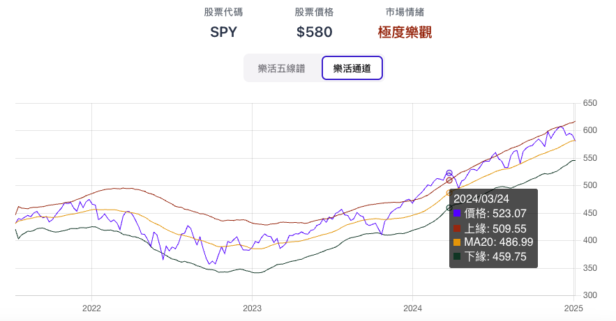
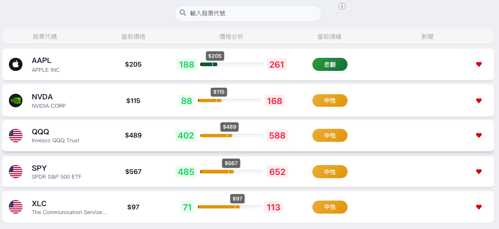

德國股神科斯托蘭尼(Endre Kosztolányi)的名言：「**行情=資金＋心理**」，資金包含了基本面，如總體經濟、公司表現；心理則是指投資人情緒，也就是人性。不論是經濟還是股票價格的上下循環，其實都來自於人的不理性，如果大家都是理性的，那我們會看到的應該是一條直線有著穩定固定的斜率，而不是像現實中各種數據具有波峰與谷底。

在投資市場中，除了關注公司的基本面之外，「**市場情緒**」也是一個不容忽視的重要指標。它反映了投資者對市場的整體看法和感受，如同股市的溫度計，能幫助我們判斷市場是過熱還是過冷，進而做出更明智的投資決策，避免跟著市場情緒起舞。

## 目錄

1.  [什麼是市場情緒？](#什麼是市場情緒？)
2.  [為什麼市場情緒如此重要？](#為什麼市場情緒如此重要？)
3.  [知道市場當前情緒，然後呢？](#知道市場當前情緒，然後呢？)
4.  [所以基本面分析不重要嗎？](#所以基本面分析不重要嗎？)
5.  [用樂活五線譜確認股價趨勢以及偏離程度](#用樂活五線譜確認股價趨勢以及偏離程度)
6.  [如何解讀樂活五線譜？](#如何解讀樂活五線譜？)
7.  [如何使用樂活通道輔助判斷？](#如何使用樂活通道輔助判斷？)
8.  [運用追蹤清單同時確認多個標的五線譜位階](#運用追蹤清單同時確認多個標的五線譜位階)

## 什麼是市場情緒？

簡單來說，市場情緒就是投資者對市場未來走向的整體感受，可以是樂觀、悲觀，或是中性。這種情緒會直接影響投資者的買賣行為，進而推動股價的波動。

## 為什麼市場情緒如此重要？

市場情緒是重要的轉折指標：熊市當中，當市場上的最後一個投資者決定轉向悲觀、離開或是做空股市的那一刻，只要沒有下一個更悲觀的人出現，這就是整體市場情緒最為悲觀的時刻，也是股市起漲的開始；相反的，牛市當中，當市場上的最後一個投資者決定轉向樂觀、進場或是做多股市的那一刻，只要沒有下一個更樂觀的人出現進一步去推升股價，這就是整體市場情緒最為樂觀的時刻，也是股市下跌的開始。

> **要避免自己成為那最後一個投資者，賣在最低、買在最高，就必須注意自己是否跟著市場情緒起舞。**

## 知道市場當前情緒，然後呢？

當你能夠判斷出市場當前是過熱/過冷，你就能夠做出更好的投資決策： 當市場情緒過於樂觀（貪婪）時，可能意味著市場存在泡沫，股價有回調的風險；而當市場情緒過於悲觀（恐懼）時，則可能提供了逢低買入的機會。也就是巴菲特（Warren Buffett）著名的「**別人恐懼時我貪婪，別人貪婪時我恐懼。**」

## 所以基本面分析不重要嗎？

不是，基本面分析依然重要，但是股價不只是反映公司價值，還反映了情緒，否則也不會每天劇烈上下波動了，畢竟公司基本面怎麼可能無時無刻在上衝下洗呢？

你可以先透過基本面選出一隻標的趨勢斜率是穩定朝著右上前進的直線，來提高勝率，然後再了解市場情緒，來判斷什麼時候該買、什麼時候該賣，這就是科斯托蘭尼的主人(基本面)與狗(股價)理論，股價是圍繞著基本面上下波動的。

如果不懂的如何分析基本面，最簡單的方式就是選擇美國大型指數ETF，例如SPY，美國作為長期全球經濟的火車頭，SPY的趨勢拉長來看就是穩定朝著右上前進的，非常適合使用樂活五線譜。

## 用樂活五線譜確認股價趨勢以及偏離程度

樂活五線譜的基礎建立在統計學的**均值回歸**，它假設股價長期而言會圍繞著一個平均值波動，再搭配**標準差**繪製出五條線，幫助我們判斷當前的股價相對於其長期趨勢的位置，從而了解市場當前對該股票的樂觀或悲觀程度。

要注意的是樂活五線譜有效的前提是先找到一個具備穩定向上趨勢的標的，例如台股指數ETF 0050，或是美股指數ETF SPY，這類大型指數ETF本身就因為經濟的進步、指數組成汰換的機制，而具備穩定向上的趨勢；但是如果標的本身沒有明確向上趨勢，應避免使用樂活五線譜。

樂活五線譜的五條線分別是：
*   **中間的趨勢線 (Trend Line):** 代表股價的長期移動平均線，是評估股價長期趨勢的基準。
*   **上下各兩條標準差線 (TL+SD, TL+2SD, TL-SD, TL-2SD):** 這些線是根據股價波動的統計特性計算出來的，代表股價偏離長期趨勢的程度。

## 如何解讀樂活五線譜？

*   股價位於趨勢線與上方第一條線 (TL+SD)或是下方第一條線 (TL-SD)之間: 屬於**中性**區間，可以繼續持有。

*   股價達到上方第一條線 (TL+SD)時: 屬於**樂觀**區間，可考慮賣出部分持股。
*   股價達到上方第二條線 (TL+2SD)時: 屬於**極度樂觀**區間，要再大漲機率不高，可考慮賣出更多持股。
*   股價達到下方第一條線 (TL-SD)時: 屬於**悲觀**區間，可考慮買入部分持股。
*   股價達到下方第二條線 (TL-2SD)時: 屬於**極度悲觀**區間，要再大跌機率不高，可考慮買入更多持股。

> **運用樂活五線譜工具，幫助你戰勝自己的恐懼貪婪情緒，避免賣在最低、買在最高。**

## 如何使用樂活通道輔助判斷？

雖然樂活五線譜提供了股價的長期趨勢，但是股價的短期波動可能很劇烈，身用投資人都不免希望自己能避免"接刀"或是"賣飛軋空手"。此時可以搭配「**樂活通道**」做使用，避免太早做買賣。樂活通道是根據股價的短期波動計算出來的，能更敏感地反映短期的超買超賣現象。

當股價達到樂活五線譜的極度樂觀和極度悲觀，可以觀察樂活通道的變化：
*   如果股價突破樂活通道上緣： 表示短期內雖然過熱，但是趨勢有可能持續，可以考慮繼續持有。
*   如果股價跌破樂活通道下緣： 表示短期內雖然過冷，但是趨勢有可能持續，可以考慮繼續等待。

當以上情況出現，可以等待股價再次回到樂活通道內，再進行考慮操作。不過這部分因個人操作而異，左側交易者可能寧願提早接刀，而右側交易者可能寧願等到轉折趨勢出現才操作，每個人風險忍受程度不同，請自行斟酌。

## 運用追蹤清單同時確認多個標的五線譜位階

如果你有多個標的，想要快速確認他們當前價格位於五線譜的位階，可以將他們加入追蹤清單：[https://sentimentinsideout.com/watchlist](https://sentimentinsideout.com/watchlist)。加入清單的標的會自動顯示五線譜的位階，方便你快速比較。其中一個使用方式是加入不同類股ETF、或是QQQ和DIA的輪動上，可以觀察到市場情緒在不同產業間的流動。

下一篇文章我們會再介紹如何透過其他數據分析美股市場投資人的情緒。

文章發佈時間：2025/1/13

文章分類：工具教學