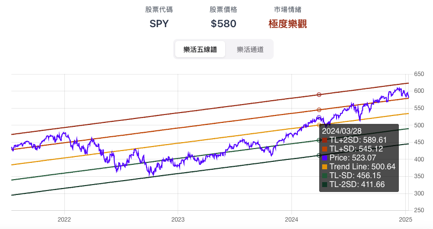
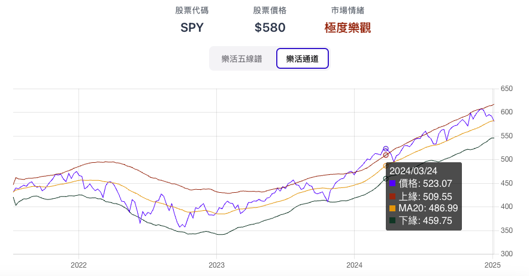
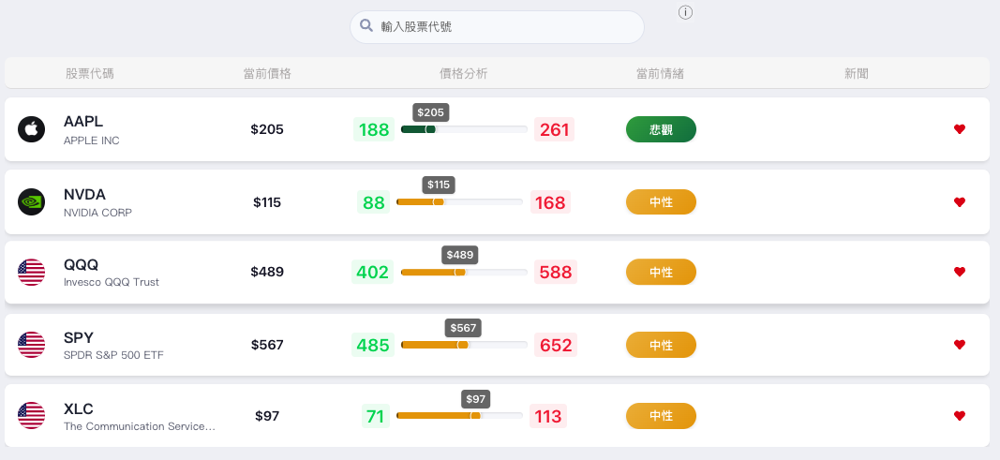

看到 SPY 回檔，你想知道的是：它只是跌了一點，還是已經偏離原本的趨勢？**樂活五線譜把股價放回趨勢裡看，再用樂活通道確認它是否走出近期區間。**

先打開[樂活五線譜](/zh-TW/priceanalysis)，輸入 SPY，選擇 3.5 年。接著看價格落在哪兩條線之間，以及下方的樂活通道有沒有突破。本文用這兩張圖帶你完成判讀。

## 目錄

1. [用樂活五線譜確認股價趨勢以及偏離程度](#用樂活五線譜確認股價趨勢以及偏離程度)
2. [如何解讀樂活五線譜？](#如何解讀樂活五線譜)
3. [如何使用樂活通道輔助判斷？](#如何使用樂活通道輔助判斷)
4. [運用追蹤清單同時確認多個標的五線譜位階](#運用追蹤清單同時確認多個標的五線譜位階)
5. [價格、情緒與基本面怎麼搭配](#價格情緒與基本面怎麼搭配)

## 用樂活五線譜確認股價趨勢以及偏離程度

樂活五線譜的基礎建立在統計學的**均值回歸**，它假設股價長期而言會圍繞著一個平均值波動，再搭配**標準差**繪製出五條線，幫助我們判斷當前的股價相對於其長期趨勢的位置，從而了解市場當前對該股票的樂觀或悲觀程度。

要注意的是樂活五線譜有效的前提是先找到一個具備穩定向上趨勢的標的，例如台股指數ETF 0050，或是美股指數ETF SPY，這類大型指數ETF本身就因為經濟的進步、指數組成汰換的機制，而具備穩定向上的趨勢；但是如果標的本身沒有明確向上趨勢，應避免使用樂活五線譜。

樂活五線譜的五條線分別是：
*   **中間的趨勢線 (Trend Line):** 由所選期間的收盤價做線性迴歸，作為衡量股價偏離程度的基準。
*   **上下各兩條標準差線 (TL+SD, TL+2SD, TL-SD, TL-2SD):** 這些線是根據股價波動的統計特性計算出來的，代表股價偏離長期趨勢的程度。

## 如何解讀樂活五線譜？

*   股價位於趨勢線與上方第一條線 (TL+SD)或是下方第一條線 (TL-SD)之間: 屬於**中性**區間，可以繼續持有。

*   股價達到上方第一條線 (TL+SD)時: 屬於**貪婪**區間，可考慮賣出部分持股。
*   股價達到上方第二條線 (TL+2SD)時: 屬於**極度貪婪**區間，價格已明顯高於趨勢，接著確認樂活通道是否也突破上緣。
*   股價達到下方第一條線 (TL-SD)時: 屬於**恐懼**區間，可考慮買入部分持股。
*   股價達到下方第二條線 (TL-2SD)時: 屬於**極度恐懼**區間，價格已明顯低於趨勢，接著確認樂活通道是否也跌破下緣。

> **運用樂活五線譜工具，幫助你戰勝自己的恐懼貪婪情緒，避免賣在最低、買在最高。**

## 如何使用樂活通道輔助判斷？

雖然樂活五線譜看得出股價離趨勢線多遠，但股價的波動可能很劇烈，一般投資人都不免希望自己能避免「接刀」或是「賣飛軋空手」。此時可以搭配「**樂活通道**」做使用，避免太早做買賣。樂活通道用最近 20 週的最高價與最低價算出上下緣，看的是當前股價有沒有走出最近的價格區間，用來輔助判斷情緒。

當股價達到樂活五線譜的極度貪婪或極度恐懼，可以觀察樂活通道的變化：
*   如果股價也突破樂活通道上緣：表示已經漲過最近 20 週的價格區間，但趨勢有可能持續，可以考慮繼續持有。
*   如果股價也跌破樂活通道下緣：表示已經跌出最近 20 週的價格區間，但趨勢有可能持續，可以考慮繼續等待。

當以上情況出現，可以等待股價再次回到樂活通道內，再進行考慮操作。不過這部分因個人操作而異，左側交易者可能寧願提早接刀，而右側交易者可能寧願等到轉折趨勢出現才操作，每個人風險忍受程度不同，請自行斟酌。

## 運用追蹤清單同時確認多個標的五線譜位階

如果你有多個標的，想要快速確認他們當前價格位於五線譜的位階，可以將他們加入追蹤清單：[/zh-TW/watchlist](/zh-TW/watchlist)。加入清單的標的會自動顯示五線譜的位階，方便你快速比較。其中一個使用方式是加入不同類股ETF、或是QQQ和DIA的輪動上，可以觀察到市場情緒在不同產業間的流動。

## 價格、情緒與基本面怎麼搭配

我喜歡科斯托蘭尼「主人與狗」的比喻：基本面像主人，股價像來回跑動的狗。選標的時先看基本面，決定是否值得持有；五線譜則幫你看目前的價格，離原本的趨勢有多遠。

市場恐慌時，不急著跟著賣；市場亢奮時，也先確認自己是不是在追價。拿同一組基準回看不同日期，比只憑當天漲跌更容易檢查自己的判斷。

**先用 SPY 或 0050 試一次，再把關注的標的加入 Pro 追蹤清單，集中比較價格位階。** 想了解整個市場的情緒，可接著看 SIO 的八項訊號。

---

下一篇：[用SIO恐懼貪婪指標判斷買賣時機](/zh-TW/articles/2.用市場情緒綜合指數判斷買賣時機)

[查看所有市場情緒指標的最新讀數](/zh-TW/sentiment-indicators)
