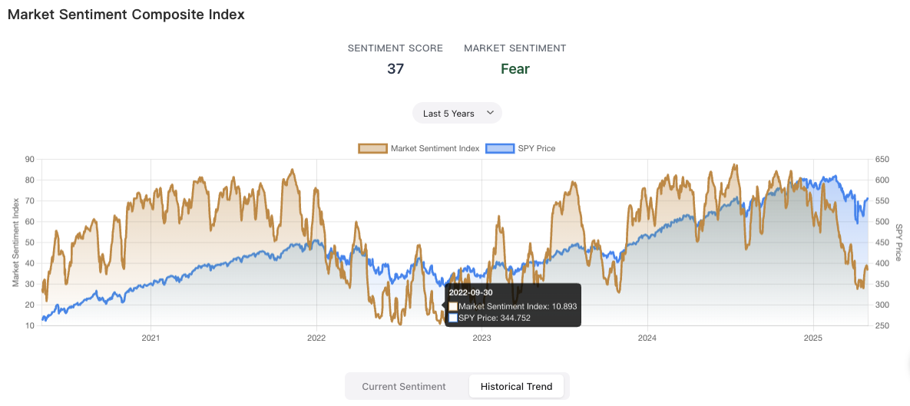
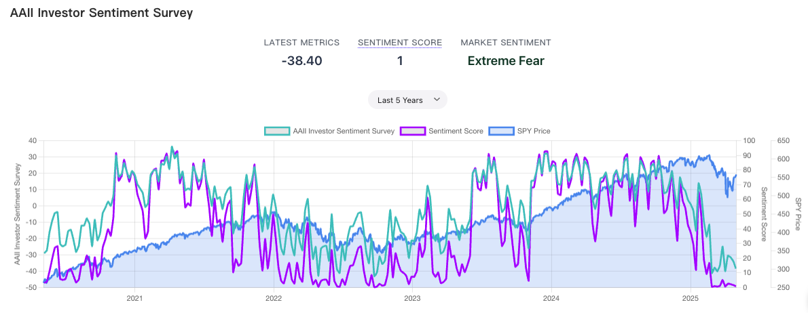
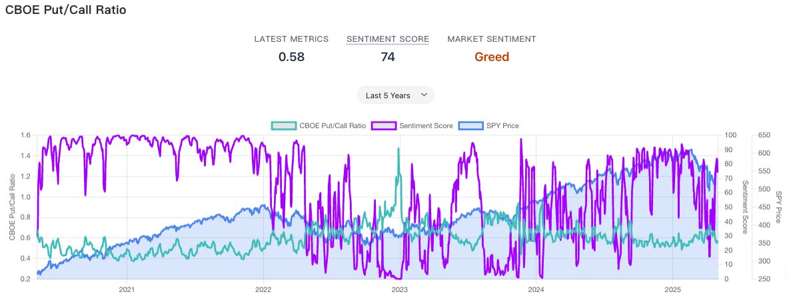
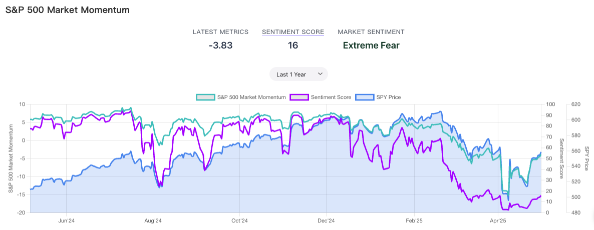
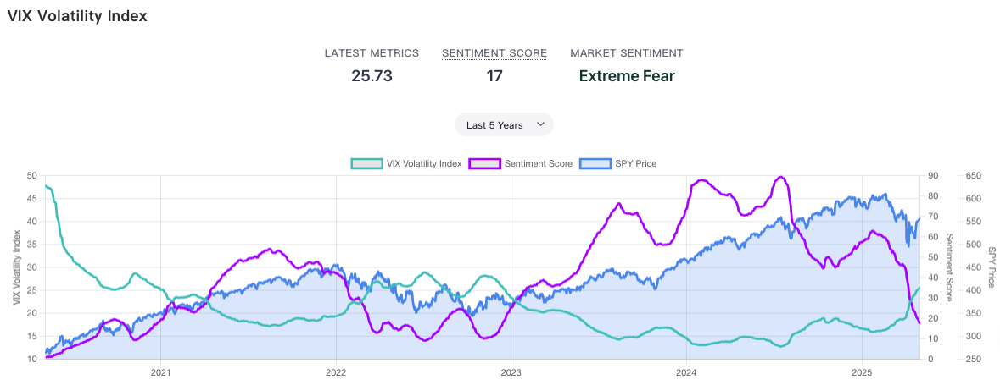
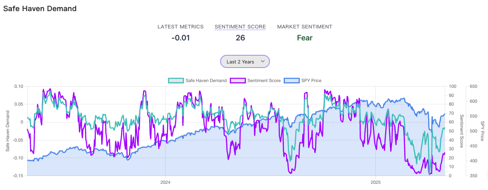
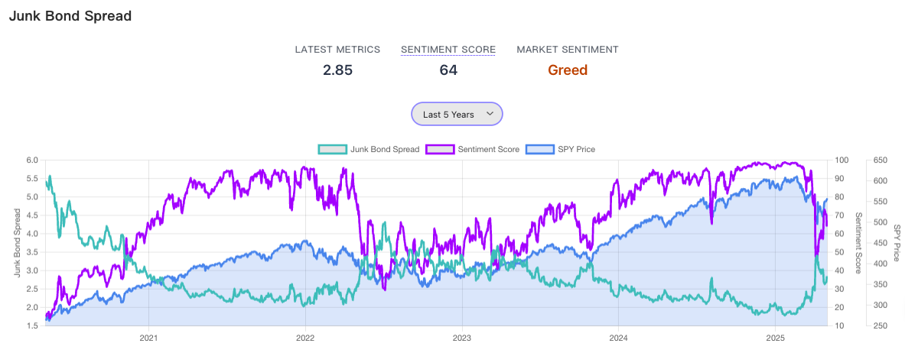
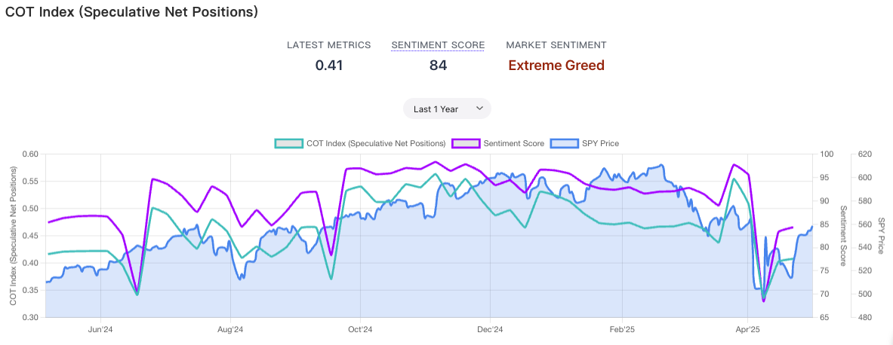
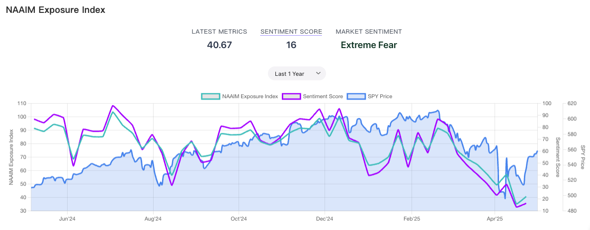
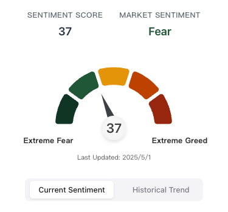

Following up on our previous article, [Analyzing Price Trends and Sentiment with LOHAS Five-Line Analysis](https://sentimentinsideout.com/articles/1.%E7%94%A8%E6%A8%82%E6%B4%BB%E4%BA%94%E7%B7%9A%E8%AD%9C%E5%88%86%E6%9E%90%E5%83%B9%E6%A0%BC%E8%B6%A8%E5%8B%A2%E8%88%87%E6%83%85%E7%B7%92), we now know how to use the LOHAS tool to identify price trends and deviations. But beyond individual stock prices, how else can we determine if the *overall market* is in a state of extreme sentiment? This article will introduce several important data points and show how to use the SIO Fear & Greed Index to help time buy and sell decisions.

## Table of Contents

1. [Pros and Cons of Common Sentiment Indicators](#pros-and-cons-of-common-sentiment-indicators)
2. [SIO Fear & Greed Index: A Long-Term Fear & Greed Indicator](#sio-fear--greed-index-a-long-term-fear--greed-indicator)
3. [Analyzing Individual Sentiment Indicators](#analyzing-individual-sentiment-indicators)
   - [AAII Investor Sentiment Survey](#1-aaii-investor-sentiment-survey-the-aaii-investor-sentiment-survey)
   - [CBOE Put/Call Ratio](#2-cboe-putcall-ratio-cboe-putcall-ratio-5-day-avg)
   - [Market Momentum](#3-market-momentum)
   - [VIX Volatility Index](#4-vix-volatility-index-vix-ma50)
   - [Safe Haven Demand](#5-safe-haven-demand)
   - [Junk Bond Spread](#6-junk-bond-spread)
   - [S&P 500 COT Index](#7-sp-500-futures-speculative-net-position-index-sp-500-cot-index)
   - [NAAIM Exposure Index](#8-naaim-exposure-index-naaim-exposure-index)
4. [How to Interpret the SIO Fear & Greed Index?](#how-to-interpret-the-sio-fear--greed-index)

## Pros and Cons of Common Sentiment Indicators

You're likely familiar with various market sentiment indicators, such as the CNN Fear & Greed Index or the Bank of America Bull & Bear Indicator. The latter isn't easily accessible to the public and relies on occasional shared reports. The CNN index, however, is public and probably the one most people see regularly.

*(CNN Fear & Greed Index)*

However, the CNN index has a drawback: it fluctuates frequently and sharply. If you backtest it against the SPY, you'll find that even when the index hits 'Extreme Fear,' the market can still fall significantly further. Therefore, it's arguably better suited for short-term trading. Additionally, the CNN index omits some key indicators, notably the AAII retail investor sentiment survey (discussed below), which is unfortunate since retail sentiment is often considered a contrarian signal.

> **While common, the CNN Fear & Greed Index is quite sensitive and arguably better suited for short-term trading.**

## SIO Fear & Greed Index: A Long-Term Fear & Greed Indicator

In contrast to the CNN index, the [SIO Fear & Greed Index](https://sentimentinsideout.com/market-sentiment) (pictured below) was specifically designed to reflect *long-term* overall market fear and greed. This tool integrates multiple market sentiment indicators, adjusts them based on their individual characteristics to reduce noise, and calculates a composite score that intuitively shows the current overall market mood. Backtesting against the S&P 500 ETF (SPY) shows that during major lows when the Sentiment Index was near or below 5, these periods proved to be excellent long-term buying opportunities.

> **The SIO Fear & Greed Index is a long-term indicator. Readings near or below 5 have historically been excellent long-term buying points.**

## Analyzing Individual Sentiment Indicators

Below, we'll break down the meaning behind the important market sentiment indicators included in our Composite Index:

### 1. AAII Investor Sentiment Survey (The AAII Investor Sentiment Survey)

Intro: The AAII (American Association of Individual Investors) Sentiment Survey measures the optimism or pessimism of retail investors regarding the market's direction over the next six months. It surveys its members weekly.

Calculation & Interpretation:
Members are asked weekly about their outlook (Bullish, Bearish, or Neutral) for the next six months. A common metric is the AAII Bull-Bear Spread = Bullish Percentage - Bearish Percentage.

Positive Value: More bulls than bears; sentiment leans optimistic.
Negative Value: More bears than bulls; sentiment leans pessimistic.
Extreme Values: Generally, a spread exceeding +/-20% indicates extreme sentiment, increasing the probability of a market reversal.

AAII is considered a contrarian indicator: excessive retail optimism may signal an impending downturn, while excessive pessimism may signal an upcoming rally.

### 2. CBOE Put/Call Ratio (CBOE Put/Call Ratio 5-Day Avg)

Intro: The CBOE (Chicago Board Options Exchange) Put/Call Ratio measures the ratio of traded put options (bearish bets or hedges) to call options (bullish bets). It reflects market participants' expectations.

Calculation & Interpretation:
Calculates the ratio of put volume to call volume. Typically uses a 5-day or 10-day average to smooth short-term noise.

Higher Ratio: More puts traded than calls; sentiment leans pessimistic as investors buy protection.
Lower Ratio: More calls traded than puts; sentiment leans optimistic as investors speculate on gains.
Extreme Values: Depends on the smoothing and specific options series, but on this site, the range is often between 0.4 (Extreme Greed) and 0.8 (Extreme Fear).

The CBOE Put/Call Ratio is a contrarian indicator: a very high ratio might signal an impending bounce, while a very low ratio might signal an impending pullback.

### 3. Market Momentum

Intro: Measures the speed and strength of the S&P 500 index's price movement to gauge trend strength.

Calculation & Interpretation:
Compares the S&P 500 index to its 125-day moving average, calculating the current price's deviation from this long-term average.

Positive Value: Strong upward momentum, optimistic trend.
Negative Value: Weak momentum, pessimistic trend.
Extreme Values: Typically ranges between -10 and +10, but has reached -20 to -30 during extreme panic.

Market Momentum is often viewed as a contrarian indicator at extremes: excessively high momentum may suggest an impending decline, while very low momentum may suggest an upcoming rise.

### 4. VIX Volatility Index (VIX MA50)

Intro: The VIX (CBOE Volatility Index) measures the market's expectation of 30-day volatility. It's often called the "fear index" because it tends to spike when the market falls.

Calculation & Interpretation Concept:
Think of the VIX as a market anxiety gauge. It's calculated using the prices of S&P 500 options expiring in about 30 days.

1.  **Focus on Near-Term Options:** Uses prices of both call and put options with roughly 30 days to expiration.
2.  **Considers Various Prices:** Incorporates options at different strike prices (both in-the-money and out-of-the-money) to capture a broad expectation of future price movement.
3.  **Calculates Implied Volatility:** Option prices are used to derive implied volatility, which is then weighted. Options closer to the current index price (at-the-money) have a higher weighting as they are more sensitive to volatility changes.
4.  **Estimates Future Volatility:** The final VIX number represents the market's expectation of the annualized standard deviation of the S&P 500's price movement over the next 30 days.

Simply put, a higher VIX means the market expects more significant price swings (higher fear/uncertainty).

For long-term sentiment analysis on this site, the VIX reading is smoothed using a 50-day moving average (MA50).

Higher Value: Market expects higher future volatility; investors are fearful.
Lower Value: Market expects lower future volatility; investors are complacent or greedy.
Extreme Values: Typically ranges between 10 and 30, but has spiked to 50-60 during extreme panic.

The VIX is a contrarian indicator: extremely high VIX levels often coincide with market bottoms (buying opportunities), while very low VIX levels can signal complacency before a potential downturn.

### 5. Safe Haven Demand

Intro: Measures the flow of funds between the stock market (risk-on) and the bond market (risk-off/safe haven). When risk perception increases, money tends to move from stocks to safer bonds, and vice versa.

Calculation & Interpretation:
Uses SPY (S&P 500 ETF) for stocks and IEF (7-10 Year Treasury Bond ETF) for bonds. Calculates the percentage difference in their price performance over the past 20 trading days.

Large Positive Value: Stocks significantly outperform bonds; low safe haven demand. Indicates optimism, funds flowing into stocks.
Large Negative Value: Bonds significantly outperform stocks; high safe haven demand. Indicates worry, funds flowing into bonds.
Extreme Values: Often ranges between -0.1 and +0.1, but has reached -0.2 to -0.3 during extreme fear.

Safe Haven Demand is a contrarian indicator: very high demand (large negative value) may signal a market bottom is near, while very low demand (large positive value) may signal excessive optimism before a pullback.

### 6. Junk Bond Spread

Intro: The Junk Bond Spread measures investor risk appetite by comparing the yield difference between high-yield corporate bonds (junk bonds) and investment-grade corporate bonds.

Calculation & Interpretation:
Uses data from the Federal Reserve (FRED). Calculates the yield on junk bonds minus the yield on investment-grade bonds. This spread represents the extra compensation investors demand for holding riskier junk debt.

Higher Spread: Investors are worried about risk and demand a larger premium for holding junk bonds. Sentiment is fearful.
Lower Spread: Investors are more comfortable with risk and accept a smaller premium. Sentiment is optimistic/greedy.
Extreme Values: Often ranges between 2% and 4%, but has spiked above 6% during periods of extreme market stress.

The Junk Bond Spread is a contrarian indicator: a very wide spread often occurs near market bottoms, while a very narrow spread can signal complacency near market tops.

### 7. S&P 500 COT Index (S&P 500 COT Index)

Intro: The S&P 500 Commitment of Traders (COT) Index measures the sentiment of speculators in the futures market, based on the weekly COT report from the CFTC (Commodity Futures Trading Commission).

Calculation & Interpretation:
Based on the CFTC's COT report, it aggregates the long positions of leveraged funds and asset managers, subtracts their short positions (speculator net position). It also calculates the net position of dealers (hedgers). The index reflects the difference between speculator and hedger net positions relative to total open interest.

Higher Value: Speculators are net long; market sentiment leans optimistic.
Lower Value: Speculators are net short (or less net long); market sentiment leans pessimistic.
Extreme Values: Typically ranges between 0 and 0.4, but has dipped below 0 during extreme fear.

The COT Index is a contrarian indicator: extreme speculator optimism (high reading) can signal a market top, while extreme pessimism (low reading) can signal a market bottom.

### 8. NAAIM Exposure Index (NAAIM Exposure Index)

Intro: The NAAIM (National Association of Active Investment Managers) Exposure Index reflects the average equity exposure level reported by professional active investment managers in a weekly survey.

Calculation & Interpretation:
Calculates the average reported stock exposure percentage from surveyed members (0% = no stocks, 100% = fully invested, >100% = leveraged).

Higher Value: Managers have high stock exposure; indicates optimism.
Lower Value: Managers have low stock exposure; indicates pessimism.
Extreme Values: Typically ranges between 20 and 100, but has fallen below 20 during extreme fear.

The NAAIM Index is a contrarian indicator: very high exposure among managers can signal complacency near market tops, while very low exposure can signal excessive pessimism near market bottoms.

> **Market sentiment might seem abstract, but it can indeed be measured and interpreted through data.**

## How to Interpret the SIO Fear & Greed Index?

After reviewing all these indicators, and comparing them to the S&P 500, we can see that while some might catch tops or bottoms, no single indicator is perfectly reliable. This is why relying on a single metric isn't advisable, and why we need a comprehensive view.

Since these indicators have different scales, comparing them directly is difficult. Therefore, the website converts each one into a standardized 'Fear & Greed Score' from 0 to 100, making it easy to intuitively grasp the sentiment level represented by the current data. The 'SIO Fear & Greed Index' takes this a step further by combining all these individual scores into a single value from 0 to 100, categorized into five levels:

* **0-20: Extreme Fear**: Signals extreme pessimism, historically a strong 'buy the dip' signal.
* **21-40: Fear**: Suggests pessimism, consider starting to scale into positions.
* **41-60: Neutral**: Market sentiment is neutral.
* **61-80: Greed**: Indicates optimism, consider reducing leverage or trimming positions.
* **81-100: Extreme Greed**: Signals excessive optimism/potential bubble, consider significantly reducing exposure.

If you don't have time to delve into each indicator, don't worry! This composite index summarizes the results for you, providing a quick snapshot of market sentiment.

You might be thinking, 'Why not just wait for those once-in-a-decade panics where the score drops below 5 to buy?'

Sure, you could do that, but you might also end up missing out on some great entry points. Not every market scare pushes the indicator below 5—for instance, the panics in 2011 and 2025 stayed above that level.

The best approach is to scale in using a 'batch entry' strategy. According to my current backtest results, a solid plan is to start entering once the score hits 15 (deploying, say, 50% of your position) and then finish buying (getting to 100%) if it drops below 5. Of course, it ultimately depends on your own tolerance for short-term losses, so feel free to use your own judgment.

> **Looking back at historical data, periods of Extreme Fear have consistently proven to be excellent buying opportunities for long-term investors.**

By effectively using the 'LOHAS Five-Line Analysis' and the 'SIO Fear & Greed Index' tools provided on the site, you can make decisions based on both price analysis and emotional readings. While these tools won't guarantee you'll catch every minor market turn, I'm confident they can significantly help you identify major opportunities, make sounder decisions, and conquer your own fear and greed!
I hope this article helps you better understand and utilize the website's tools. Happy investing!

