繼上一篇[用樂活五線譜分析價格趨勢與情緒](https://sentimentinsideout.com/articles/1.%E7%94%A8%E6%A8%82%E6%B4%BB%E4%BA%94%E7%B7%9A%E8%AD%9C%E5%88%86%E6%9E%90%E5%83%B9%E6%A0%BC%E8%B6%A8%E5%8B%A2%E8%88%87%E6%83%85%E7%B7%92)，我們已經知道如何透過樂活五線譜確認股價趨勢以及偏離程度，但是除了價格以外，還有什麼方式可以判斷整體市場是否處於極端情緒呢？這一篇我們將介紹幾個重要的數據，並透過Sentiment Inside Out 恐懼貪婪指標 (簡稱:SIO恐懼貪婪指標)來判斷買賣時機。

## 目錄

1. [常見的市場情緒指標優缺點](#常見的市場情緒指標優缺點)
2. [SIO恐懼貪婪指標：長期市場的恐懼與貪婪指標](#SIO恐懼貪婪指標長期市場的恐懼與貪婪指標)
3. [解析個別情緒指標](#解析個別情緒指標)
   - [AAII 投資者情緒調查](#1-aaii-投資者情緒調查-the-aaii-investor-sentiment-survey)
   - [CBOE 買/賣權比例](#2-cboe-買賣權比例-cboe-putcall-ratio-5-day-avg)
   - [市場動能](#3-市場動能-market-momentum)
   - [VIX 恐慌指數](#4-vix-恐慌指數-vix-ma50)
   - [避險需求](#5-避險需求-safe-haven-demand)
   - [垃圾債殖利率差](#6-垃圾債殖利率差-junk-bond-spread)
   - [S&P 500 期貨投機淨持倉指數](#7-sp-500-期貨投機淨持倉指數-sp-500-cot-index)
   - [NAAIM 投資經理人曝險指數](#8-naaim-投資經理人曝險指數-naaim-exposure-index)
4. [如何解讀SIO恐懼貪婪指標？](#如何解讀SIO恐懼貪婪指標)

## 常見的市場情緒指標優缺點

相信大家都知道市場上的各種情緒指標，包含像是 CNN Fear Greed Index 或是 BoFA Bull Bear Indicator 等等，後者不是普通人能取得的，只能等待偶爾有人願意分享，至於前者是公開、也是大家應該比較常看到的。

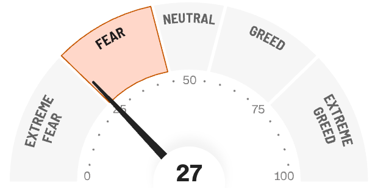

*(CNN Fear & Greed Index)*

但是 CNN 指數有個缺點，就是波動頻繁、劇烈，如果你搭配SPY回測，會發現有時候即便當指標處於極度恐懼，股市都還可以有一大段可以跌。因此它其實比較適合短線操作。此外 CNN 指數納入的指標不多，尤其我個人最常看的美國 AAII 散戶指標(下面會介紹)就不其中，滿可惜的，畢竟散戶通常是反指標(?)。

> **CNN 恐懼貪婪指數雖然常見，但較為敏感，比較適合短線操作。**

## SIO恐懼貪婪指標：長期市場的恐懼與貪婪指標

相對於CNN指數，[SIO恐懼貪婪指標](https://sentimentinsideout.com/market-sentiment)(下圖)就是為了反映長期整體市場的恐懼貪婪情緒而誕生的。這個工具整合了多個市場情緒指標，並依照個別指標的特性調整、減少波動，計算出一個綜合指數，直觀地呈現當前市場的整體情緒。如果搭配美國 S&P 500的ETF SPY 進行回測，在過往幾次大崩盤時，當情緒指數落在5附近都是非常好的買點。 

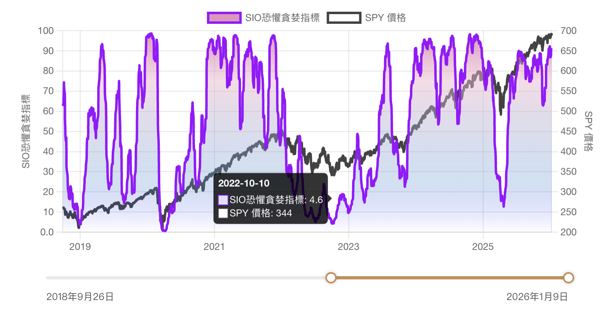

> **市場情緒指數是長期的市場情緒指標，當指數落在5附近都是長線上極佳的買點。**

## 解析個別情緒指標

以下我們會介紹SIO恐懼貪婪指標所包含的多個重要的市場情緒指標所代表的意義：

### 1. AAII 投資者情緒調查 (The AAII Investor Sentiment Survey)

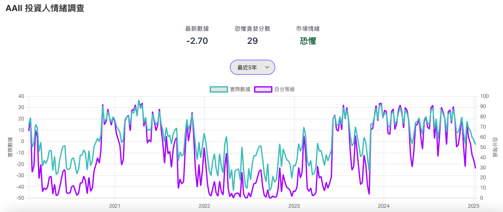

簡介：AAII（美國個人投資者協會）投資者情緒調查是一個衡量散戶投資者對未來市場走向的樂觀或悲觀程度的指標。它每週會請會員回覆對未來六個月股市的預期，並公佈統計數據。

計算及解讀方式：
每週調查一次，當中會詢問會員對未來六個月股市的看法，只有三個選項，分別為看漲（Bullish）、看跌（Bearish）和中性（Neutral）。而常見的計算方式就是 AAII Bull-Bear Spread (看多看空差額) = 看漲的百分比 - 看跌的百分比。

正值：表示看漲的投資者多於看跌的投資者，市場情緒偏向樂觀。

負值：表示看跌的投資者多於看漲的投資者，市場情緒偏向悲觀。

極端值：一般來說差值達到20%以上，就表示市場情緒已經達到極端值，市場反轉機率高。

AAII 作為一個反向指標，當散戶過於樂觀時，可能暗示市場即將下跌；當散戶過於悲觀時，可能暗示市場即將上漲。

### 2. CBOE 買/賣權比例 (CBOE Put/Call Ratio 5-Day Avg)

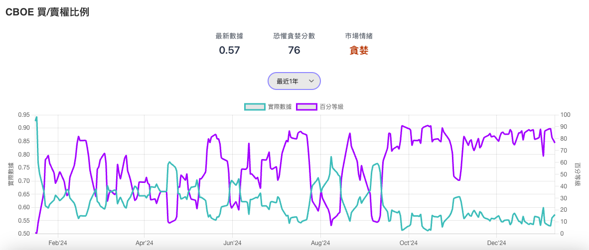

簡介：CBOE（芝加哥期權交易所）買/賣權比例是一個衡量投資者購買看跌期權（Put）和看漲期權（Call）比例的指標。反映了市場參與者對未來市場走向的預期。

計算及解讀方式：
計算看跌期權的交易量與看漲期權的交易量比例，通常使用5日或10日平均值，以平滑短期波動。

比例愈高：表示看跌期權的交易量高於看漲期權，市場情緒偏向悲觀，投資者傾向於購買看跌期權來保護投資組合。

比例愈低：表示看漲期權的交易量高於看跌期權，市場情緒偏向樂觀，投資者傾向於購買看漲期權來獲取收益。

極端值：依平滑計算方式和買賣權商品而有不同，以此站來說，大多介於0.4(極端貪婪)~0.8(極端恐懼)之間。

CBOE 作為一個反向指標，當買/賣權比例過高時，可能暗示市場即將反彈；當買/賣權比例過低時，可能暗示市場即將下跌。

### 3. 市場動能 (Market Momentum)

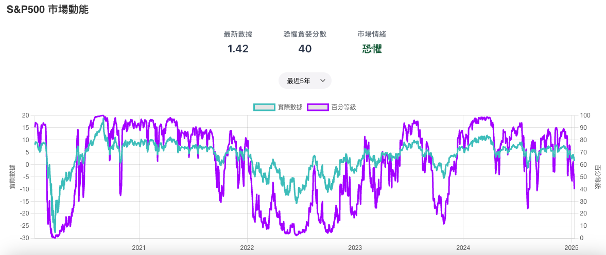

簡介：用於衡量 S&P 500 指數價格變動的速度和強度，來判斷市場趨勢的強弱。

計算及解讀方式：
動能指標是藉由比較S&P500指數與其125日移動平均線，計算當前價格相對於長期平均的差異。

正值：表示動能強勁，樂觀趨勢

負值：表示動能疲弱，悲觀趨勢

極端值：動能指數一般介於-10到10之間，但是當市場出現極度恐慌時，數值也曾經飆到-20到-30。

市場動能作為一個反向指標，當動能過高時，可能暗示市場即將下跌；當動能過低時，可能暗示市場即將上漲。

### 4. VIX 恐慌指數 (VIX MA50)

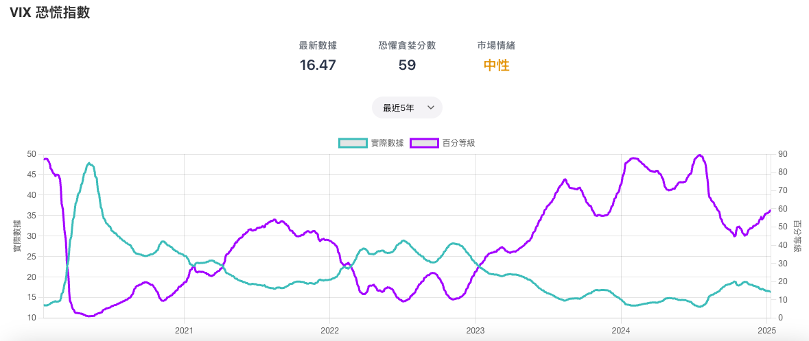

簡介：VIX（芝加哥期權交易所波動率指數）恐慌指數衡量市場對未來 30 天波動性的預期。它通常被稱為「恐慌指數」，因為它在市場下跌時往往會飆升。

計算及解讀方式：
VIX 指數就像是市場恐慌程度的溫度計，它主要是看 S&P 500 指數的「選擇權」價格來計算的。

簡單來說，VIX 指數的計算步驟如下：

1.  **看未來一個月的選擇權：**  採用 S&P 500 指數未來 30 天左右到期的買權（Call Options）和賣權（Put Options）的價格。

2.  **各種價格的選擇權都考慮：**  計算時會用到不同「執行價格」（Strike Price）的買權（Call）和賣權（Put），特別是涵蓋價內（In-the-money）和價外（Out-of-the-money）的選擇權，以全面捕捉市場對未來價格變動的預期。

3.  **計算波動率：**  將這些選擇權的價格轉換成隱含波動率（Implied Volatility），再進行加權計算，得出一個整體的波動率估計。

    *   **越接近現在價格的貢獻越高：**  特別是那些執行價格接近當前 S&P 500 指數的選擇權（即平價選擇權），它們對波動率的貢獻更大，因為這些選擇權對市場波動的敏感度更高。

4.  **轉換成波動率：**  最後，根據這些加權平均的選擇權價格，計算出市場預期未來 30 天的波動幅度。

    *   **預期波動的標準差：**  VIX 指數其實就是市場預期未來 30 天 S&P 500 指數價格波動的「標準差」。指數越高，代表市場預期未來波動會很大，反之亦然。

如果上面的內容看得霧煞煞沒關係，總之就是 VIX 指數越高，代表市場越緊張、越恐慌。

網站上的 VIX 指標，為了用於長期市場情緒判讀，額外使用 50 日移動平均值（MA50）來平滑 VIX 指數的波動。

數值愈高：表示市場預期未來波動性較高，投資者對市場感到恐懼。

數值愈低：表示市場預期未來波動性較低，投資者對市場感到貪婪。

極端值：大多介於10~30之間，但是當市場出現極度恐慌時，數值也曾經飆到50~60。

VIX 恐慌指數作為一個反向指標，當 VIX 恐慌指數過高時，可能暗示市場即將反彈；當 VIX 恐慌指數過低時，可能暗示市場即將下跌。

### 5. 避險需求 (Safe Haven Demand)

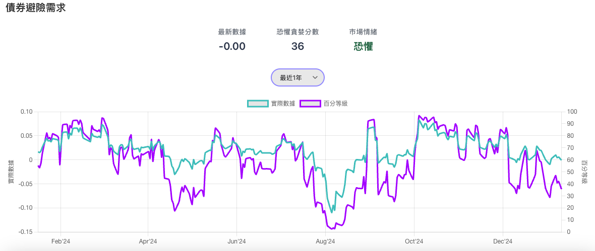

簡介：避險需求衡量資金在股市和債市之間的流動。當市場風險增加時，投資者通常會將資金從股市轉移到相對安全的債市，反之亦然。

計算及解讀方式：
使用 SPY (SPDR S&P 500 ETF Trust) 和 IEF (iShares 7-10 Year Treasury Bond ETF) 分別作為股市和債券市場的代表，計算過去20個交易日的價格變動百分比差異。

正值越大：表示股票市場相對於債券市場的表現越好，避險需求越低。投資者對市場風險感到樂觀，資金從債市流向股市。

負值越大：表示股票市場相對於債券市場的表現越差，避險需求越高。投資者對市場風險感到擔憂，資金從股市流向債市。

極端值：平時大多介於-0.1~+0.1之間，但是當市場出現極度恐慌時，數值也曾經飆到-0.2~-0.3。

避險需求作為一個反向指標，當避險需求過高時，可能暗示市場即將反彈；當避險需求過低時，可能暗示市場即將下跌。

### 6. 垃圾債殖利率差 (Junk Bond Spread)

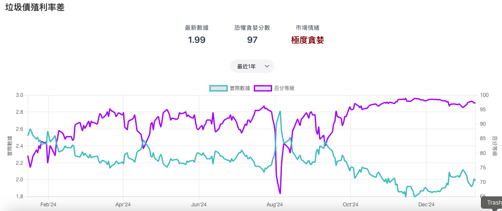

簡介：垃圾債殖利率差 (Junk Bond Spread) 是一個衡量投資者對風險偏好程度的指標。它通過比較高收益債券（通常被稱為「垃圾債」）和投資級債券之間的殖利率差異，來反映市場對風險的態度。

計算及解讀方式：
使用聯邦儲備銀行 (FRED) 的數據，將垃圾債的殖利率減去投資級債券的殖利率，得到殖利率差。這個差異值代表了投資者對持有垃圾債所要求的額外風險補償。

數值愈高：表示垃圾債的殖利率高於投資級債券的殖利率，投資者對風險感到擔憂，要求垃圾債提供更高的殖利率作為風險補償。

數值愈低：表示垃圾債的殖利率低於投資級債券的殖利率，投資者對風險感到樂觀，願意接受較低的垃圾債殖利率。

極端值：平時大多介於2~4之間，但是當市場出現極度恐慌時，數值也曾經飆到6以上。

垃圾債殖利率差作為一個反向指標，當垃圾債殖利率差過高時，可能暗示市場即將反彈；當垃圾債殖利率差過低時，可能暗示市場即將下跌。

### 7. S&P 500 期貨投機淨持倉指數 (S&P 500 COT Index)

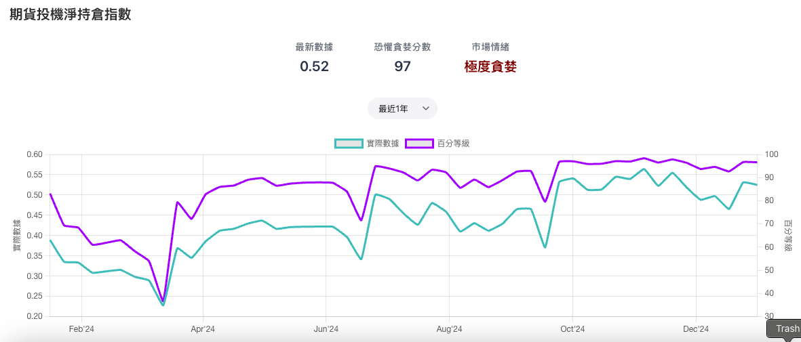

簡介：S&P 500 期貨投機淨持倉指數 (S&P 500 COT Index) 是一個衡量期貨市場中投機者情緒的指標。基於美國商品期貨交易委員會 (CFTC) 的持倉報告 (COT Report)，幫助我們了解投機者對 S&P 500 指數的整體看法。

計算及解讀方式：
基於美國商品期貨交易委員會（CFTC）的持倉報告（COT Report），將槓桿基金和資產管理者的多頭持倉加總，減去他們的空頭持倉加總，得到投機者的淨持倉量。再計算經銷商的多頭持倉減去他們的空頭持倉，得到避險者的淨持倉量。計算投機者和避險者的淨持倉佔總開放權益的比例，並將兩者相減。

數值愈大：表示投機者持有多頭部位多於空頭部位，市場情緒偏向樂觀。

數值愈小：表示投機者持有空頭部位多於多頭部位，市場情緒偏向悲觀。

極端值：一般介於0~0.4之間，但是當市場出現極度恐慌時，數值也曾經低於0。

S&P 500 期貨投機淨持倉指數作為一個反向指標，當投機者過於樂觀時，可能暗示市場即將下跌；當投機者過於悲觀時，可能暗示市場即將上漲。

### 8. NAAIM 投資經理人曝險指數 (NAAIM Exposure Index)

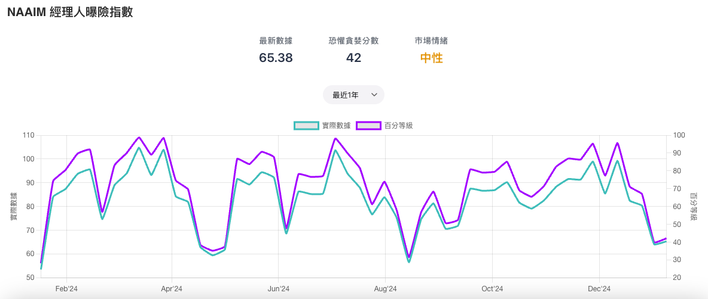

簡介：NAAIM（美國主動投資經理人協會）投資經理人曝險指數反映了專業投資經理人對股市的曝險程度。它通過每週調查會員的股票投資組合比例來收集數據。

計算及解讀方式：
調查會詢問會員的股票投資組合比例，計算會員股票投資組合比例的平均值。

數值愈高：表示專業投資經理人對股市的曝險程度較高，市場情緒偏向樂觀。

數值愈低：表示專業投資經理人對股市的曝險程度較低，市場情緒偏向悲觀。

極端值：一般介於20~100之間，但是當市場出現極度恐慌時，數值也曾經低於20。

NAAIM 投資經理人曝險指數作為一個反向指標，當專業投資經理人過於樂觀時，可能暗示市場即將下跌；當專業投資經理人過於悲觀時，可能暗示市場即將上漲。

> **市場情緒看似抽象，其實仍然可以透過數據衡量和解讀。**

## 如何解讀SIO恐懼貪婪指標？

看完上面這麼多指標，如果再對照 S&P 500 指數，我們會發現當中某些指標雖然能抓到高低點，但準確率又不夠高，這也是為什麼我們其實不該依賴單一指標，而是需要將所有指標做綜合考量。

而由於上述這些指標都有各自不同的基準，不能直接放在一起比較，因此網站將他們全部轉換成了0~100的恐懼貪婪分數，方便大家直觀了解當前數據代表的情緒狀態。而「SIO恐懼貪婪指標」則是再進一步將上述所有指標綜合計算成一個 0 到 100 的分數，並劃分為五個等級：：

* **0-20：極度恐懼** (Extreme Fear)：表示市場極度悲觀，應該勇敢逢低買入
* **21-40：恐懼** (Fear)：表示市場悲觀，可以考慮開始分批投入
* **41-60：中性** (Neutral)：表示市場情緒中性
* **61-80：貪婪** (Greed)：表示市場樂觀，需要降低槓桿或減碼
* **81-100：極度貪婪** (Extreme Greed)：表示市場過於樂觀，可能存在泡沫，應該大幅減碼

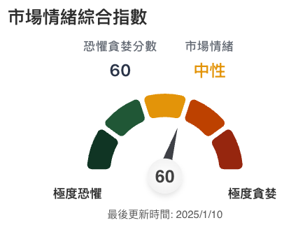

如果你沒時間研究個別指標也沒關係，這個綜合指數就是以上一切指標的綜合結果，可以幫助你一秒了解市場情緒。

當然你可能會想，那是不是就等5分以下這種歷史級別的恐慌出現再買就好？ 
可以，但你也可能因此錯過一些買點，並非每次恐慌時都會跌倒5分(例如2011和2025的恐慌都沒有低於5分)，
最好的做法還是分批佈局，
目前作者回測結果是，在15分以下就可以開始分批入場(例如50%的部位)，5分以下則是可以買完(買到100%)，
不過當然還是看個人的短期虧損忍受度如何，可以自行判斷。

> **回顧歷史數據，當市場處於極度恐懼時，長線來看都是買入的好時機。**

善用網站提供的「樂活五線譜」和「SIO恐懼貪婪指標」這兩大工具，透過價格和情緒的雙重判斷，雖然不能保證你抓到每一波小轉折，但我有信心絕對能幫你把握重大機會做出正確的決策，戰勝自己的恐懼貪婪情緒！
希望這篇文章能幫助您更好地理解和運用網站的工具，祝各位投資順利！
