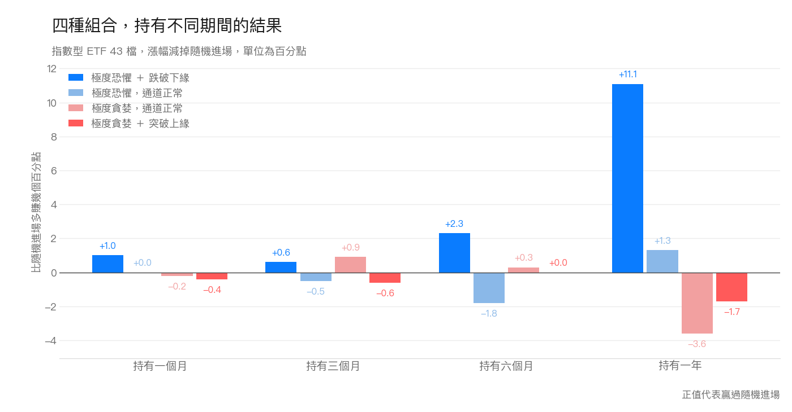
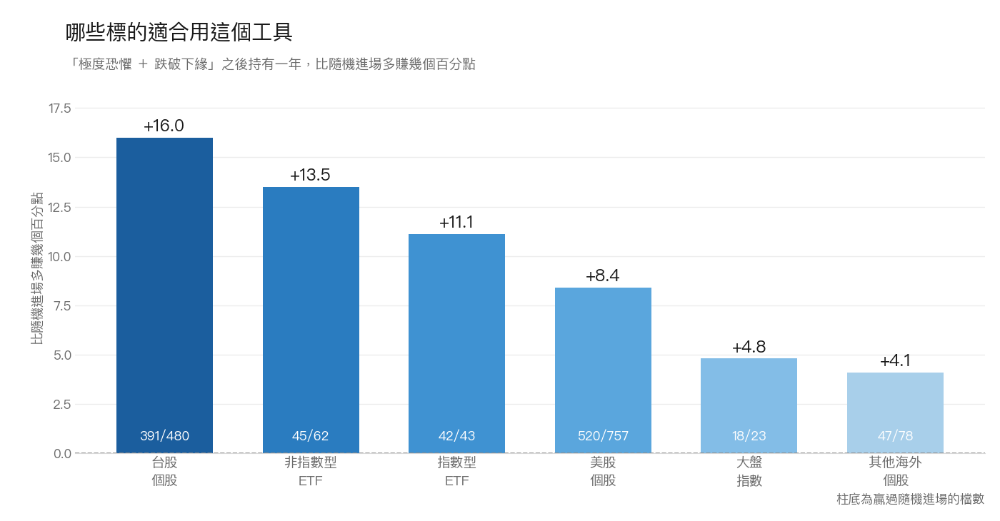
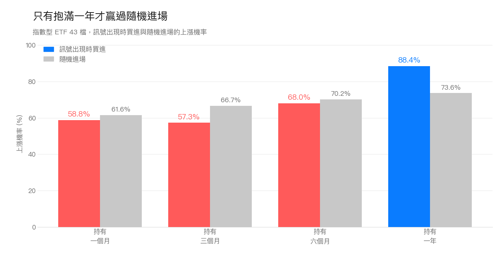
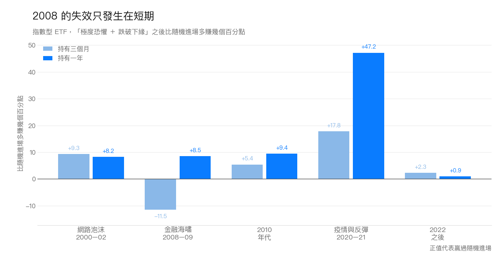

樂活五線譜這個工具我們用了很久，網站上也寫過[怎麼看懂它](https://sentimentinsideout.com/articles/1.%E7%94%A8%E6%A8%82%E6%B4%BB%E4%BA%94%E7%B7%9A%E8%AD%9C%E5%88%86%E6%9E%90%E5%83%B9%E6%A0%BC%E8%B6%A8%E5%8B%A2%E8%88%87%E6%83%85%E7%B7%92)。用久了會冒出幾個問題。

「極度貪婪」到底多久出現一次？樂活五線譜和樂活通道分開放在頁面上，它們給的是兩份不同的資訊嗎？看到「極度恐懼」的時候，接下來通常會發生什麼事？

還有一個更實際的：原作者建議「跌破樂活通道之後，等價格回到通道內再動作」，這句話真的對嗎？

這次把 1,449 個標的、1,155 萬筆日線全部跑了一遍，資料最早回到 1927 年。

重點摘要

1. 「極度恐懼」單獨出現的日子一年約 16 天，這些日子進場的三個月與六個月報酬輸給隨機進場。等樂活通道也跌破下緣，符合條件的日子一年約 5 天。
2. 跌破之後價格通常還在跌。等回到通道內才進場，六組標的、四個持有期間，24 格全部比較好。
3. 進場後只有抱滿一年才有明顯差別。指數型 ETF 抱一年比隨機進場多 11.1 個百分點，抱一個月只多 1.0。
4. 賣的時候同一個規則也成立。看到「極度貪婪 ＋ 突破上緣」，等價格回到通道內再賣，六類標的都躲掉了後面的下跌。

## 目錄

1. [為什麼要兩張圖一起看](#為什麼要兩張圖一起看)
2. [四種組合裡只有一種值得買](#四種組合裡只有一種值得買)
3. [什麼時候買](#什麼時候買)
4. [什麼時候賣](#什麼時候賣)
5. [延伸：金融海嘯的例外只出現在短期](#延伸金融海嘯的例外只出現在短期)
6. [延伸：加 RSI、MACD、成交量有用嗎](#延伸加-rsimacd成交量有用嗎)

## 為什麼要兩張圖一起看

畫面上的樂活五線譜和樂活通道是兩張圖。這篇的數字看的都是兩張圖同時說什麼，原因有兩個。

第一，只看樂活五線譜的話，極端狀態太常出現。五條線分出來的五種狀態各佔多少日子：

| 分組 | 極度恐懼 | 恐懼 | 中性 | 貪婪 | 極度貪婪 |
|---|---|---|---|---|---|
| 指數型 ETF | 9.5% | 12.8% | 40.7% | 26.3% | 10.2% |
| 大盤指數 | 8.4% | 13.1% | 45.2% | 23.0% | 10.5% |
| 非指數型 ETF | 7.8% | 13.5% | 44.5% | 23.8% | 10.1% |
| 美股個股 | 7.7% | 14.9% | 45.2% | 20.2% | 12.0% |
| 台股個股 | 5.8% | 17.4% | 48.9% | 16.6% | 10.9% |
| 其他海外個股 | 6.0% | 15.4% | 47.5% | 17.9% | 12.2% |

兩個標準差以外的區域，如果價格的偏離真的照著鐘形曲線分布，理論上不到 5% 的日子。實際上兩邊加起來有 17% 到 22%，是理論值的四倍。原因是股價的極端偏離比理論上多，而且趨勢會延續：漲過頭之後常常繼續漲，於是連續好幾週都掛著「極度貪婪」。

所以樂活五線譜單獨顯示「極度貪婪」，大約每十天就會出現一次。只看這一張圖，資訊量比想像中少。

第二，兩張圖常常不同調。當市場情緒已經到了極度恐懼或極度貪婪，樂活通道同時也突破上下緣的比例：

| 分組 | 情緒到極端時，通道也突破的比例 |
|---|---|
| 大盤指數 | 49% |
| 台股個股 | 45% |
| 非指數型 ETF | 42% |
| 美股個股 | 41% |
| 指數型 ETF | 40% |
| 其他海外個股 | 36% |

四成上下。六成的時候其中一張還在正常範圍。

這個結果比我們預期的好。如果兩張圖幾乎完全重疊，第二張就沒有存在價值；如果完全無關，把它們湊在一起也沒有意義。四成重疊代表它們有共同的部分，也各自帶了對方沒有的資訊。

所以接下來只看兩端：樂活五線譜到「極度恐懼」或「極度貪婪」的日子，各自再分成樂活通道也突破了、還在通道內兩種。兩兩相乘就是四種組合。

## 四種組合裡只有一種值得買

以下用指數型 ETF（0050、SPY、QQQ 這類）當例子。

每一格是這個組合出現的當天買進，比隨機進場多賺幾個百分點。隨機進場就是同一檔標的隨便挑一天買進、抱同樣長度，約等於不看訊號的人拿到的報酬。百分點是兩個報酬率相減：訊號進場一年賺 20%、隨機進場賺 9%，差就是 11 個百分點。

| 你在畫面上看到的 | 一年出現幾天 | 一個月 vs 隨機 | 三個月 vs 隨機 | 六個月 vs 隨機 | 一年 vs 隨機 |
|---|---|---|---|---|---|
| **極度恐懼 ＋ 跌破下緣** | 5 | +1.0 | +0.6 | +2.3 | **+11.1** |
| 極度恐懼，通道還正常 | 16 | +0.0 | −0.5 | −1.8 | +1.3 |
| 極度貪婪，通道還正常 | 9 | −0.2 | +0.9 | +0.3 | −3.6 |
| 極度貪婪 ＋ 突破上緣 | 12 | −0.4 | −0.6 | −0.0 | −1.7 |

註：1,449 檔標的、11,556,801 筆日線，1927 到 2026 年。每一檔先各自算完再取中位數，一兩檔漲很多不會主導結果。要提醒的是，同一場崩盤會讓多檔標的同時觸發訊號，所以筆數雖然大，互相獨立的極端事件是幾十次的量級。第 5 節把資料切成五個時期分開算，就是在檢驗這件事。程式和完整結果放在 repo 的 `research/lohas-horizons/`。

四種組合裡只有第一種在四個期間都是正的，而且要抱滿一年才明顯，多賺 11.1 個百分點。抱一個月只多賺 1.0，幾乎等於沒有。

另外三種都不值得買。「極度恐懼但通道還正常」出現的天數是第一種的三倍，三個月和六個月反而輸給隨機進場。兩種「極度貪婪」的八格裡有五格是負的，抱滿一年分別少賺 3.6 和 1.7 個百分點。至於該不該賣，是另一個問題，第 4 節專門處理。

## 什麼時候買

買進的訊號是「極度恐懼 ＋ 跌破下緣」。

### 哪些標的適合

每一格是訊號出現的當天買進，比隨機進場多賺幾個百分點。最後一欄要一起看：多賺的幅度是中位數，可能被幾檔特別強的拉高，最後一欄告訴你這一類裡有多少檔真的是同一個方向。

| 分組 | 一個月 vs 隨機 | 三個月 vs 隨機 | 六個月 vs 隨機 | 一年 vs 隨機 | 抱一年時，多少檔同方向 |
|---|---|---|---|---|---|
| 大盤指數 | +2.0 | +2.2 | +1.8 | +4.8 | 18/23 |
| 指數型 ETF | +1.0 | +0.6 | +2.3 | +11.1 | **42/43** |
| 非指數型 ETF | +1.7 | +2.0 | +3.5 | +13.5 | 45/62 |
| 美股個股 | +1.3 | +2.7 | +2.8 | +8.4 | 520/757 |
| 台股個股 | +0.7 | +1.1 | +5.8 | **+16.0** | 391/480 |
| 其他海外個股 | +2.4 | +3.0 | +2.9 | +4.1 | 47/78 |

指數型 ETF 最可靠，43 檔裡有 42 檔同方向。台股個股幅度最大，多賺 16.0 個百分點，480 檔裡有 391 檔同方向。大盤指數只多賺 4.8，因為指數本來就比較穩，跌不到那麼極端。其他海外個股 78 檔裡只有 47 檔同方向，用在這一類要保守。

同方向的檔數要打個折來看。同一場崩盤會讓一整類標的同時觸發訊號，43 檔指數型 ETF 在 2008 年是一起跌的，所以 42/43 說的是這個結果在不同標的之間夠穩定，不等於 43 次互相獨立的驗證。要看它撐不撐得住不同年代，第 5 節把資料切成五個時期分開算。

### 什麼時候動手

樂活通道的原作者建議過：價格跌破下緣之後不要馬上買，等它回到通道內再說。我們把每一段跌出通道的區間抓出來，只留下期間內情緒也到極度恐懼的那些，比較同一段區間的兩個時點。

每一格是等回到通道內才買，比跌破當下就買多賺幾個百分點。

| 分組 | 一個月 vs 當下買 | 三個月 vs 當下買 | 六個月 vs 當下買 | 一年 vs 當下買 | 抱一年時，多少檔同方向 |
|---|---|---|---|---|---|
| 大盤指數 | +8.7 | +6.4 | +9.7 | +9.2 | **19/19** |
| 指數型 ETF | +8.3 | +6.6 | +7.7 | +8.6 | 41/43 |
| 非指數型 ETF | +7.9 | +7.1 | +6.8 | +9.2 | **51/51** |
| 美股個股 | +12.4 | +12.4 | +14.0 | +14.7 | 722/732 |
| 台股個股 | +11.6 | +11.7 | +12.9 | +15.5 | 414/423 |
| 其他海外個股 | +11.2 | +9.4 | +10.0 | +9.7 | 59/62 |

六組、四個期間，24 格全部都是等回來比較好，而且六組裡有 95% 以上的標的都是同一個方向。跌破當下就買，六組在一個月的報酬全是負的。

價格走在通道外面，代表那一段下跌還在進行，這時候動手就是逆著它做。等價格回到通道內，代表那一段至少暫停了。

### 要抱多久

只有持有一年，六組都明顯贏過隨機進場。以指數型 ETF 為例，抱一個月多賺 1.0 個百分點、三個月 0.6、六個月 2.3，到一年才跳到 11.1。前三個都不到 2.5。

換成上漲的機率也一樣。指數型 ETF 持有一年，訊號進場的上漲機率是 88%，隨機進場是 74%。但持有三個月的話，訊號進場只有 57%，反而輸給隨機進場的 67%。

### 一個代價要先講清楚

這不代表隔天就會漲。指數型 ETF 在訊號出現之後三個月，價格最深還會再往下探 10.0%，隨機進場只跌 4.6%。這兩個數字是跌幅本身，不是前面那種相減後的差距。看到訊號就重壓的人，中間那一段會很難受。

## 什麼時候賣

賣出要問的是賣掉之後有沒有躲掉下跌。

對照的還是隨便挑一天，只是這次是賣出，以下叫隨機賣出。一樣是數字越大越好，只是這次大代表這一賣避開的跌幅越多。

賣出點取「極度貪婪 ＋ 突破上緣」那一段突破結束、價格回到通道內的那一天。從訊號出現到那一天，中位數等 10 個交易日，大約兩週。為什麼取這一天而不取突破的當下，下一小節會驗。

### 哪些標的適合

每一格是訊號出現後賣出，比隨機賣出多躲掉幾個百分點。

| 分組 | 賣後一個月 vs 隨機賣 | 賣後三個月 vs 隨機賣 | 賣後六個月 vs 隨機賣 | 賣後一年 vs 隨機賣 | 賣後一個月時，多少檔同方向 |
|---|---|---|---|---|---|
| 大盤指數 | +1.7 | +2.0 | +0.9 | +3.2 | **23/23** |
| 指數型 ETF | +1.7 | +1.3 | +0.1 | +2.8 | 40/43 |
| 非指數型 ETF | +2.1 | +2.8 | +2.1 | +3.2 | 55/58 |
| 美股個股 | +2.9 | +3.7 | +3.8 | +4.9 | 728/759 |
| 台股個股 | **+3.7** | +4.0 | +4.0 | **+7.6** | 439/480 |
| 其他海外個股 | +3.4 | +3.6 | +4.0 | +5.5 | 75/78 |

註：35,160 個賣出點、1,441 檔標的。整體來看，1,441 檔裡有 1,360 檔是同一個方向。

六組全部都躲掉了。台股個股最多，這一賣比隨機賣出多避開 3.7 個百分點的跌幅。大盤指數 23 檔全數同方向，但幅度只有 1.7。

個股比 ETF 和指數有用。三組個股是 2.9 到 3.7，三組指數與 ETF 只有 1.7 到 2.1。這跟買的時候正好相反，買的時候最可靠的是指數型 ETF。

這一賣躲掉的是一個月。賣掉之後那個月，股價下跌的機率是 61%；隨機賣出只有 44%。所以在這個時點賣，確實閃過了一段真的下跌。

但撐不了更久。到了六個月，股價通常已經漲回去，賣掉的好處只剩下比隨機賣出少賠一點，稱不上躲過什麼。

### 什麼時候動手

跟買的時候同一個問題：突破上緣的當下就賣，還是等價格回到通道內再賣？

每一格是等回到通道內才賣，比突破當下就賣多躲掉幾個百分點。

| 分組 | 賣後一個月 vs 當下賣 | 賣後三個月 vs 當下賣 | 賣後六個月 vs 當下賣 | 賣後一年 vs 當下賣 | 賣後一個月時，多少檔同方向 |
|---|---|---|---|---|---|
| 大盤指數 | +3.0 | +3.4 | +1.9 | +3.7 | **23/23** |
| 指數型 ETF | +1.4 | +1.4 | +1.8 | +3.5 | **43/43** |
| 非指數型 ETF | +2.9 | +3.1 | +1.5 | +3.5 | 57/58 |
| 美股個股 | +4.5 | +5.0 | +4.7 | +5.2 | 753/759 |
| 台股個股 | **+7.0** | +7.7 | +6.7 | +8.2 | 473/480 |
| 其他海外個股 | +5.5 | +4.9 | +7.4 | +6.5 | 76/78 |

一樣是 24 格全部都要等。突破當下就賣，接下來那個月股價還在漲，六組裡有五組漲得比隨機賣出還多，等於賣在漲勢中間。

原作者的建議在買和賣兩邊都成立，而且在四個期間都成立。

### 一個限制要先講清楚

躲掉下跌不等於賺到錢。賣掉之後如果空手放著，市場長期往上，一年後空手的人反而會輸給從頭抱到尾的人。這篇沒有測「什麼時候買回」，那是另一個問題。

## 延伸：金融海嘯的例外只出現在短期

前面的結論都是把所有年份混在一起算的。一個訊號如果只在某一段時間有效，那多半是巧合，所以把資料切成幾個時期再看一次。這一節在檢驗前面的結論撐不撐得住不同年代，只想知道怎麼用的話可以跳過。

我們沒有把 2008 和 2020 拿掉。崩盤本來就是市場會發生的事，2022 也跌了一年，沒有理由只把其中兩次當成不算數。

每一格是在那個時期買進，比隨機進場多賺幾個百分點（指數型 ETF）。

| 時期 | 一個月 vs 隨機 | 三個月 vs 隨機 | 六個月 vs 隨機 | 一年 vs 隨機 |
|---|---|---|---|---|
| 網路泡沫 2000–02 | +6.4 | +9.3 | +12.0 | +8.2 |
| **金融海嘯 2008–09** | **−6.0** | **−11.5** | −6.2 | **+8.5** |
| 2010 年代 | +2.0 | +5.4 | +5.5 | +9.4 |
| 疫情與反彈 2020–21 | +8.5 | +17.8 | +22.5 | +47.2 |
| 2022 之後 | +2.6 | +2.3 | −1.5 | +0.9 |

註：1990 年代和 2003–2007 多頭沒有列出來，那兩段符合條件的指數型 ETF 只有 1 檔和 3 檔，數字沒有代表性。

金融海嘯確實是例外，但只在短期。持有一個月輸 6.0 個百分點，三個月輸 11.5。那次下跌又深又久，三個月不夠讓價格回來。

拉長到一年，2008 反而變成贏 8.5 個百分點。五個時期在一年的尺度上都是正的，其中 2022 之後只有 +0.9，接近打平。

短期不可靠，期間夠長就在每個年代都站得住。

## 延伸：加 RSI、MACD、成交量有用嗎

常有人問要不要再加 KD、RSI、MACD。與其比較指標本身，不如問一個實際一點的問題：在「極度恐懼」的日子，加上哪一個條件之後那一個月最好？

每一格是加上這個條件，比什麼都不加多賺幾個百分點。

| 加上的條件（vs 什麼都不加） | 指數型 ETF | 大盤指數 | 非指數型 ETF | 美股個股 | 台股個股 |
|---|---|---|---|---|---|
| RSI 低於 30 | **+1.9** | +0.8 | **+0.6** | **+0.5** | +0.6 |
| 波動度處在近一年高檔 | +1.3 | **+1.9** | +0.5 | +0.3 | **+0.7** |
| MACD 柱狀圖翻正 | +0.7 | +0.0 | −0.2 | −0.0 | −0.0 |
| 樂活通道也跌破下緣 | +0.4 | +1.0 | −0.0 | +0.0 | −0.3 |
| 成交量放大 1.5 倍以上 | −0.9 | −0.3 | −0.5 | +0.1 | +0.5 |

在一個月的尺度上，RSI 低於 30 比樂活通道好。五組裡有三組排第一，另外兩組也排前二，波動度處在近一年高檔緊追在後。樂活通道只在大盤指數那組排第二，其餘四組都在中後段，台股個股甚至低於什麼都不加。

兩者回答的是不同的期間。樂活通道的價值出現在一年，多賺 11.1 個百分點；一個月的反彈由 RSI 抓得比較準。

成交量幾乎沒有幫助。指數型 ETF 加上成交量放大反而少賺 0.9 個百分點。很多人把帶量下跌當成恐慌出清的訊號，資料不支持這個說法。
