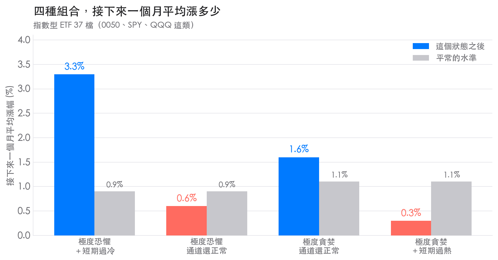
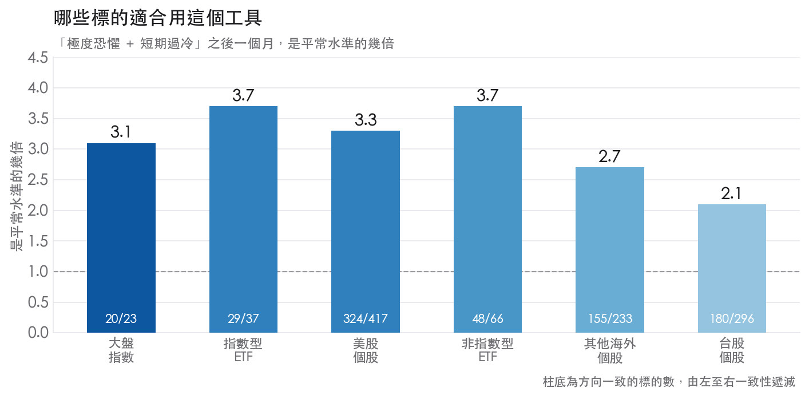
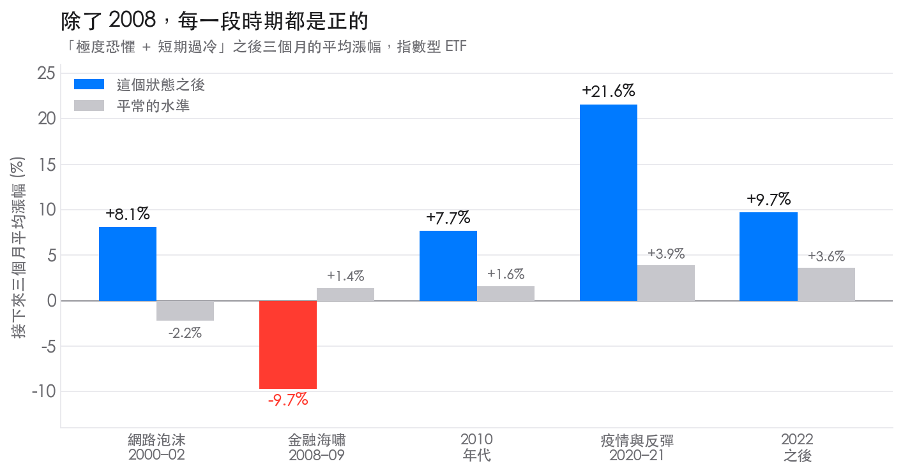

樂活五線譜這個工具我們用了很久，網站上也寫過[怎麼看懂它](https://sentimentinsideout.com/articles/1.%E7%94%A8%E6%A8%82%E6%B4%BB%E4%BA%94%E7%B7%9A%E8%AD%9C%E5%88%86%E6%9E%90%E5%83%B9%E6%A0%BC%E8%B6%A8%E5%8B%A2%E8%88%87%E6%83%85%E7%B7%92)。用久了會冒出幾個問題：

「極度貪婪」這個標籤，到底多久亮一次？市場情緒和樂活通道分開放在頁面上，它們給的是兩份不同的資訊嗎？看到「極度恐懼」的時候，接下來通常會發生什麼事？還有那句流傳很廣的操作建議——「跌破通道之後，等價格回到通道內再動作」——真的比較划算嗎？

這次把 1,257 個標的、576 萬筆日線全部跑了一遍，資料最早回到 1931 年。有幾個結果跟我們原本以為的不一樣。

## 目錄

1. [先看結論：四種組合各代表什麼](#先看結論四種組合各代表什麼)
2. [哪些標的適合用這個工具](#哪些標的適合用這個工具)
3. [我們怎麼測的](#我們怎麼測的)
4. [「極度貪婪」每十天就出現一次](#極度貪婪每十天就出現一次)
5. [兩張圖有一半的時間看法不同](#兩張圖有一半的時間看法不同)
6. [兩個都到極端的那 6 天](#兩個都到極端的那-6-天)
7. [只有情緒到極度恐懼的那 12 天](#只有情緒到極度恐懼的那-12-天)
8. [情緒到極度貪婪的時候](#情緒到極度貪婪的時候)
9. [2008 是唯一的例外](#2008-是唯一的例外)
10. [跌破通道之後要不要等它回來](#跌破通道之後要不要等它回來)
11. [加 RSI、MACD、成交量有用嗎](#加-rsimacd成交量有用嗎)
12. [這些數字不能拿來做什麼](#這些數字不能拿來做什麼)

## 先看結論：四種組合各代表什麼

頁面上「市場情緒」和「樂活通道」兩個欄位湊起來只有四種值得注意的組合。以指數型 ETF（0050、SPY、QQQ 這類）為例：

| 你在頁面上看到 | 一年出現幾天 | 接下來一個月平均漲幅 | 平常同期 | 一個月收紅機率 | 接下來三個月 | 平常同期 |
|---|---|---|---|---|---|---|
| **極度恐懼 ＋ 短期過冷** | 6 天 | **+3.3%** | +0.9% | **69%** | **+7.0%** | +2.6% |
| 極度恐懼，通道還正常 | 12 天 | +0.6% | +0.9% | 54% | +3.2% | +2.8% |
| 極度貪婪，通道還正常 | 15 天 | +1.6% | +1.1% | 64% | +4.8% | +3.2% |
| **極度貪婪 ＋ 短期過熱** | 16 天 | **+0.3%** | +1.1% | 54% | +3.1% | +3.3% |

換成白話：

| 組合 | 這代表什麼 |
|---|---|
| 極度恐懼 ＋ 短期過冷 | 全表最值得留意的一格。漲幅是平常的三到四倍，十次有七次是漲的 |
| 極度恐懼，通道還正常 | 出現次數是上面的兩倍，但漲得比平常還少，中途跌得還更深。這時候動手最不划算 |
| 極度貪婪，通道還正常 | 漲勢通常還沒結束，三個月有四分之三的機會繼續漲 |
| 極度貪婪 ＋ 短期過熱 | 一個月只漲 0.3%，漲跌機率跟丟銅板差不多。不是會崩，是不太會漲 |

如果整篇只記一件事：**看到「極度恐懼」先別急，等樂活通道也翻成「短期過冷」再說。**

底下是這些數字怎麼來的，以及幾個常見說法驗完之後的結果。

## 哪些標的適合用這個工具

這個工具當初是設計給指數型 ETF 用的，但個股能不能用？我們把六類標的分開算，看「極度恐懼 ＋ 短期過冷」之後一個月的表現，以及「極度貪婪 ＋ 短期過熱」之後一個月的表現：

| 分組 | 檔數 | 恐懼＋過冷之後 | 平常 | 是平常的幾倍 | 收紅機率 | 幾檔標的走同一個方向 |
|---|---|---|---|---|---|---|
| 指數型 ETF | 37 | +3.3% | +0.9% | 3.7 倍 | 69% | 29 / 37 |
| 大盤指數 | 23 | +2.5% | +0.8% | 3.1 倍 | 65% | **20 / 23** |
| 非指數型 ETF | 66 | +3.7% | +1.0% | 3.7 倍 | 63% | 48 / 66 |
| 美股個股 | 417 | **+4.3%** | +1.3% | 3.3 倍 | 65% | 324 / 417 |
| 台股個股 | 296 | +3.2% | +1.5% | **2.1 倍** | 63% | **180 / 296** |
| 其他海外個股 | 233 | +3.5% | +1.3% | 2.7 倍 | 63% | 155 / 233 |

| 分組 | 貪婪＋過熱之後 | 平常 | 幾檔標的變差 |
|---|---|---|---|
| 指數型 ETF | +0.3% | +1.1% | 29 / 39 |
| 大盤指數 | +1.1% | +0.8% | **9 / 23** |
| 非指數型 ETF | +0.5% | +1.4% | **64 / 87** |
| 美股個股 | +0.8% | +1.8% | 303 / 470 |
| 台股個股 | **+2.2%** | +1.6% | 152 / 324 |
| 其他海外個股 | +0.9% | +1.4% | 150 / 259 |

這裡的檔數會少於後面「我們怎麼測的」列的分組總數，因為有些標的從來沒出現過這個狀態，或次數太少不夠算。

「幾檔標的走同一個方向」這一欄很重要。如果只有少數幾檔特別誇張，平均數會很好看但沒有參考價值；比例越高，代表這件事越普遍。

整理成一句話：

| 分組 | 適合程度 |
|---|---|
| **大盤指數** | 價格偏低時最可靠，23 檔裡有 20 檔同向。偏高的時候沒有參考價值（只有 9/23 變差） |
| **指數型 ETF** | 兩邊都能用。價格偏低時漲幅是平常的 3.7 倍，偏高時 39 檔有 29 檔轉弱 |
| **非指數型 ETF**（高股息、槓桿、產業型） | 兩邊都能用，而且過熱之後轉弱最明顯（87 檔有 64 檔） |
| **美股個股** | 價格偏低時的漲幅最大（+4.3%），一致性也高。可以用 |
| **其他海外個股**（港、日、韓、A 股） | 跟美股個股接近，稍微弱一點 |
| **台股個股** | 價格偏低時效果最弱（只有平常的 2.1 倍，296 檔裡 180 檔同向）；偏高的時候還會繼續漲（+2.2%，比平常還高），跟其他市場相反 |

**指數型 ETF 和大盤指數是這個工具最穩的地方**，這跟它原本的設計用途一致。個股也能用，但要注意兩件事：一是個股的波動本來就大，同樣的訊號伴隨的跌幅更深；二是台股個股的追漲行為明顯，價格偏高的那一邊不能照著其他市場的結論用。

## 我們怎麼測的

資料是 1,257 個標的、5,762,776 筆日線，最早從 1931 年，最晚到 2026 年 8 月。分成六組來看，因為不同類型的標的差很多：

| 分組 | 檔數 | 例子 |
|---|---|---|
| 指數型 ETF | 40 | SPY、QQQ、VOO、0050、006208 |
| 大盤指數 | 23 | S&P 500、加權指數、恆生、日經、富時 100 |
| 非指數型 ETF | 94 | 0056、00631L、VYM、XLK |
| 美股個股 | 494 | 蘋果、嬌生、福特、美國航空 |
| 台股個股 | 336 | 台積電、中鋼、台塑、陽明 |
| 其他海外個股 | 270 | 港股、日股、韓股、A 股 |

個股那幾組是把資料庫裡有五年以上歷史的標的全部放進來，沒有挑過。這件事很重要：如果只挑蘋果、微軟、輝達這種一路漲上來的贏家，任何「逢低買進」的規則看起來都會很神。

計算方式跟網站上跑的完全一樣：五線譜取 3.5 年的資料做回歸，畫出趨勢線和上下各一、兩個標準差的位置；樂活通道用週線、20 週的高低點平均，再依波動度往外推。**每一天都只用當天為止的資料重算一次**，不會用到未來的價格。

表格裡的數字這樣讀：

| 欄位 | 意思 |
|---|---|
| 平均漲幅 | 符合條件的那些日子，往後 20 個交易日（約一個月）或 60 個交易日（約三個月）的平均報酬 |
| 平常同期 | 同一檔標的、同樣長度的期間，在所有日子的平均報酬。用來當對照 |
| 收紅機率 | 那段期間結束時是上漲的比例 |

每一檔標的先各自算完，再把各檔平均起來，避免少數幾檔主導結果。

## 「極度貪婪」每十天就出現一次

先看最基本的：這些標籤到底多常出現。

| 分組 | 極度恐懼 | 恐懼 | 中性 | 貪婪 | 極度貪婪 |
|---|---|---|---|---|---|
| 指數型 ETF | 8.2% | 13.3% | 44.5% | 23.1% | 10.9% |
| 大盤指數 | 8.4% | 13.3% | 45.3% | 22.2% | 10.9% |
| 非指數型 ETF | 7.3% | 12.8% | 43.2% | 24.5% | 12.1% |
| 美股個股 | 7.9% | 14.2% | 43.8% | 21.4% | 12.7% |
| 台股個股 | 6.0% | 16.8% | 47.8% | 17.0% | 12.4% |

「極度貪婪」佔了 11% 到 13% 的交易日，換算下來大約每十天就會看到一次；「極度恐懼」也有 6% 到 8%。

兩個標準差以外的區域，如果價格的偏離真的照著鐘形曲線分布，理論上只會佔 4.6% 的日子。實際上兩邊加起來有 17% 到 20%，是理論值的四倍。原因是股價的極端偏離比理論上多，而且趨勢會延續——漲過頭之後常常繼續漲，於是連續好幾週都掛著「極度貪婪」。

這解釋了一個很多人有的困惑：為什麼看到「極度貪婪」之後，價格又漲了三個月。因為這個標籤本來就不是罕見事件。**單看情緒標籤，資訊量比想像中低很多。**

## 兩張圖有一半的時間看法不同

市場情緒和樂活通道都在講「現在偏貴還是偏便宜」，那它們是不是同一件事？

直接的問法是：當市場情緒已經到了極度恐懼或極度貪婪，樂活通道同時也在極端位置的比例有多少？

| 分組 | 情緒到極端時，通道也到極端的比例 |
|---|---|
| 指數型 ETF | 48% |
| 大盤指數 | 50% |
| 非指數型 ETF | 49% |
| 美股個股 | 44% |
| 台股個股 | 46% |

大約一半。有一半的時候兩張圖給的是同一個訊息，另一半的時候其中一張還在正常範圍。

這個結果比我們預期的好。如果兩張圖幾乎完全重疊，第二張就沒有存在價值；如果完全無關，把它們湊在一起也沒有意義。一半重疊代表**它們有共同的部分，也各自帶了對方沒有的資訊**——接下來會看到，剛好是共同的那部分最有用。

## 兩個都到極端的那 6 天

市場情緒是「極度恐懼」而且樂活通道也在「短期過冷」：

| 分組 | 一個月平均漲幅 | 平常 | 收紅機率 | 三個月平均漲幅 | 平常 | 收紅機率 |
|---|---|---|---|---|---|---|
| 指數型 ETF | **+3.3%** | +0.9% | 69% | **+7.0%** | +2.6% | 70% |
| 大盤指數 | **+2.5%** | +0.8% | 65% | **+5.8%** | +2.4% | 69% |
| 非指數型 ETF | **+3.7%** | +1.0% | 63% | **+7.6%** | +3.1% | 70% |
| 美股個股 | **+4.3%** | +1.3% | 65% | **+8.8%** | +4.0% | 68% |
| 台股個股 | **+3.2%** | +1.5% | 63% | **+6.0%** | +4.5% | 62% |

一個月的平均漲幅是平常的三到四倍，收紅機率從五成多拉到六成五左右。指數型 ETF 的 37 檔裡有 29 檔是同一個方向，不是少數幾檔撐出來的。

這種狀態一年大概只有 6 個交易日，而且會連在一起出現：平均一年碰到 0.7 次，每次持續一週左右，價格反彈或通道回到正常範圍就結束了。**等於兩年才碰到一次多一點。**

有一個代價要先講清楚：**這不代表隔天就會漲。**

| 從這個狀態算起，接下來三個月 | 最深跌到 |
|---|---|
| 極度恐懼 ＋ 短期過冷 | −8.0% |
| 平常的水準 | −6.1% |

價格平均還會再往下探 8% 才回升。看到訊號就重壓的人，中間那段會很難受。

## 只有情緒到極度恐懼的那 12 天

同樣是「極度恐懼」，但樂活通道還在正常範圍：

| 分組 | 一個月平均漲幅 | 平常 | 收紅機率 | 三個月平均漲幅 | 平常 |
|---|---|---|---|---|---|
| 指數型 ETF | +0.6% | +0.9% | 54% | +3.2% | +2.8% |
| 大盤指數 | +0.1% | +0.8% | 53% | +1.7% | +2.4% |
| 非指數型 ETF | +1.1% | +1.1% | 58% | +4.0% | +3.3% |
| 美股個股 | +2.0% | +1.4% | 59% | +4.7% | +4.0% |
| 台股個股 | +1.8% | +1.5% | 57% | +5.8% | +4.8% |

指數型 ETF 和大盤指數這兩組，接下來一個月的表現比平常還差一點，收紅機率只比丟銅板高一點點。而這種狀態出現的次數是前一種的兩倍。

再看一個容易忽略的數字：

| 接下來三個月最深跌到 | |
|---|---|
| 只有情緒到極度恐懼 | −9.2% |
| 兩個都到極端 | −8.0% |
| 平常的水準 | −6.1% |

**承擔的波動更大，拿到的報酬更少。** 所以看到「極度恐懼」四個字先別急，真正把數字撐起來的是樂活通道也跟著轉成「短期過冷」的那些日子。

## 情緒到極度貪婪的時候

價格偏低的那一邊效果明顯，偏高的那一邊常被認為沒有規律。實際上偏高的那一邊也有規律，只是它是往下的，而且比較弱。

**市場情緒「極度貪婪」而且樂活通道也在「短期過熱」：**

| 分組 | 一個月平均漲幅 | 平常 | 收紅機率 | 三個月平均漲幅 | 平常 |
|---|---|---|---|---|---|
| 指數型 ETF | +0.3% | +1.1% | 54% | +3.1% | +3.3% |
| 大盤指數 | +1.1% | +0.8% | 59% | +3.0% | +2.4% |
| 非指數型 ETF | +0.5% | +1.4% | 52% | +3.7% | +4.4% |
| 美股個股 | +0.8% | +1.8% | 54% | +3.6% | +5.4% |
| 台股個股 | +2.2% | +1.6% | 49% | +6.8% | +5.2% |

指數型 ETF 接下來一個月平均只漲 0.3%，平常是 1.1%；收紅機率 54%，跟丟銅板差不多。

跟價格偏低那一邊比，這個效果小很多——那邊是「平常的三倍」，這邊只是「比平常少一點」。但方向很一致：39 檔指數型 ETF 裡有 29 檔、87 檔非指數型 ETF 裡有 64 檔都是同一個方向，剔掉 2008 和 2020 也不變。

**只有情緒到「極度貪婪」、通道還在正常範圍：**

| 分組 | 一個月平均漲幅 | 平常 | 三個月平均漲幅 | 平常 | 三個月收紅機率 |
|---|---|---|---|---|---|
| 指數型 ETF | +1.6% | +1.1% | +4.8% | +3.2% | 75% |

37 檔裡有 31 檔是這樣。通道還沒轉熱的時候，漲勢通常還沒結束；要等通道也跟著到「短期過熱」，才是兩張圖都認證的過熱。

## 2008 是唯一的例外

一個訊號只在某一段時間有效的話，那多半是巧合。我們把資料切成幾個時期，看指數型 ETF 在「極度恐懼 ＋ 短期過冷」之後三個月的平均漲幅：

| 期間 | 指數型 ETF | 平常 | 美股個股 | 平常 |
|---|---|---|---|---|
| 1990 年代 | — | — | +11.3% | +6.5% |
| 網路泡沫破裂（2000–2002） | +8.1% | −2.2% | +10.9% | +0.8% |
| 2003–2007 多頭 | — | — | +7.7% | +4.1% |
| **金融海嘯（2008–2009）** | **−9.7%** | +1.4% | **−0.8%** | +2.9% |
| 2010 年代 | +7.7% | +1.6% | +8.5% | +3.0% |
| 疫情與反彈（2020–2021） | +21.6% | +3.9% | +24.7% | +6.5% |
| 2022 之後 | +9.7% | +3.6% | +7.4% | +4.8% |

（1990 年代和 2003–2007 那兩格是空的，因為當時符合條件的指數型 ETF 還沒成立或還沒累積到足夠的資料。）

除了 2008 到 2009，每一段時期都是正的，連網路泡沫破裂那三年都是。只有金融海嘯那一次，這個狀態連續亮了一年多，三個月後平均還是虧 9.7%。

原因不難理解：海嘯期間的跌勢又深又久，三個月的窗口不夠讓價格回來。

### 那持有多久比較合適

把 2008 和 2020 這兩段特別拿掉再算一次，可以看出這個訊號的優勢是短期的還是長期的：

| 持有期間 | 全部資料 | 拿掉 2008 與 2020 |
|---|---|---|
| 一個月平均漲幅 | +3.3% | **+4.3%** |
| 一個月收紅機率 | 69% | **77%** |
| 一年比平常多漲 | +18% | +3.7% |

一年那個 18% 幾乎全部來自那兩次崩盤，拿掉之後只剩 3.7%。一到三個月的優勢則相反，拿掉之後不但還在，數字還更好。

所以這是**一到三個月的訊號**。把一年的數字當成常態，等於用崩盤後的反彈來美化平常的表現。

## 跌破通道之後要不要等它回來

樂活通道的原作者建議過：價格跌破通道下緣之後不要馬上動作，等它回到通道內再說。這條規則聽起來很合理——避免接落下的刀子。我們把每一段跌破和突破都抓出來，比較兩種進場時點接下來三個月的平均漲幅。

**跌破下緣之後：**

| 分組 | 跌破當下就進 | 等回到通道內才進 | 差 |
|---|---|---|---|
| 指數型 ETF | +4.68% | +3.26% | −1.41 |
| 大盤指數 | +4.55% | +3.94% | −0.61 |
| 非指數型 ETF | +7.40% | +4.80% | −2.61 |
| 美股個股 | +7.70% | +5.50% | −2.20 |
| 台股個股 | +4.89% | +3.55% | −1.34 |

五組全部都是負的。等待平均要付出 0.6 到 2.6 個百分點的代價，因為反彈最快的那一段常常就發生在還沒回到通道內的時候。

**突破上緣之後：**

| 分組 | 突破當下 | 等回到通道內 | 差 |
|---|---|---|---|
| 指數型 ETF | +2.99% | +4.14% | +1.15 |
| 大盤指數 | +2.72% | +2.51% | −0.21 |
| 非指數型 ETF | +1.97% | +2.76% | +0.79 |
| 美股個股 | +3.56% | +3.91% | +0.34 |
| 台股個股 | +6.90% | +6.83% | −0.07 |

這裡就沒有明顯的方向了，有正有負，幅度都不大。

所以這條規則要拆開看：**跌破的時候，等待是有成本的；突破的時候，等或不等差別不大。**

## 加 RSI、MACD、成交量有用嗎

我們常被問到要不要再搭配 KD、RSI、MACD。與其比較這些指標本身，我們直接問一個更實際的問題：在「極度恐懼」的日子裡，再加上哪一個條件，接下來一個月的表現最好？

| 第二個條件 | 指數型 ETF | 大盤指數 | 非指數型 ETF | 美股個股 | 台股個股 |
|---|---|---|---|---|---|
| **樂活通道也到短期過冷** | **+3.3%** | **+2.5%** | **+3.7%** | **+4.3%** | +3.2% |
| RSI 低於 30 | +2.8% | +2.4% | +2.7% | +3.4% | +3.2% |
| 波動度處在近一年高檔 | +2.5% | +2.0% | +2.6% | +3.3% | **+3.7%** |
| MACD 柱狀圖翻正 | +2.3% | +1.6% | +2.5% | +3.1% | +2.2% |
| 成交量放大 1.5 倍以上 | −0.1% | +0.3% | +1.9% | +2.1% | +2.4% |
| （什麼都不加） | +1.5% | +0.9% | +1.9% | +2.7% | +2.4% |

最後一列是基準：只看「極度恐懼」不加任何條件。

樂活通道在五組裡有四組排第一，而且它是網站上已經有的東西，不需要再多裝一個指標。RSI 低於 30 排第二，差距不大。MACD 翻正也有一點幫助。

成交量放大幾乎沒有用，指數型 ETF 那組甚至是負的。這跟直覺不太一樣——很多人認為爆量下跌代表恐慌到頂，但資料不支持。

## 這些數字不能拿來做什麼

**這些都是回顧歷史算出來的平均值，不是預測。** 平均漲 3.3% 的意思是，過去符合條件的那些日子平均起來是這個數字，不代表下一次也會這樣。收紅機率 69% 反過來說，就是有三成的時候是跌的。

**資料有重疊。** 同一段行情裡連續好幾天都符合條件，這些觀測不是各自獨立的，所以實際的不確定性比表面上大。我們用「有多少檔標的方向一致」來檢查這件事——例如指數型 ETF 的 37 檔裡有 29 檔同向——但這不能完全消除重疊的影響。

**過去有效不保證未來有效。** 2008 那一次就是現成的例子：一個在其他所有時期都成立的訊號，在那一年半裡連續失效。下一次也可能有類似的情況。

**這不是投資建議。** 這篇文章在講一個指標在歷史資料上的統計特性，不涉及任何個別標的的買賣判斷。實際決策還要考慮你的資金狀況、能放多久、跌多少睡得著，以及基本面。
