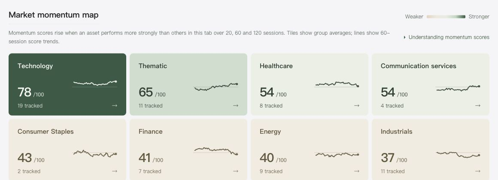

Open the [Market Momentum Dashboard](/en/momentum/) to compare groups first, then inspect individual ETFs. A category tile shows the **average momentum score** of assets in that group. A score in the ranking belongs to **one asset**. They describe different levels of the same watchlist.

The dashboard groups U.S.-listed ETFs and a few other listed products into three watchlists: Industries & Themes, Major Assets, and Market Structure. This guide explains how to read the view as market data changes. Check the dashboard's upper-right date for the latest close.

## From category map to individual ETF

### 1. Choose a watchlist

Industries & Themes covers technology, energy, financials, healthcare and thematic ETFs. Major Assets covers U.S. and international equities, bonds and commodities. Market Structure compares market-cap groups, equal-weight sectors and stock-selection strategies. **Each watchlist has its own ranking pool.** A score of 70 on one tab is not the same contest as 70 on another.

"Factor" strategies select stocks using characteristics such as momentum, quality or volatility. "Growth" groups funds tilted toward growth stocks. These are labels for the watchlist; each fund follows its own index and holdings rules.

A higher tile score means the group had stronger recent relative momentum within its watchlist; it is not a one-day percentage move. The screenshot illustrates how to read group scores; use the dashboard for the current view and values.

### 2. Choose today's move or recent momentum

In Daily Change mode, a category tile shows the **median one-day percentage move** among its members. A +1% tile means the middle move is around +1%; individual assets may differ. The asset list can also be sorted by daily change.

In Recent Momentum mode, the tile shows the **average momentum score** of its members with valid scores. The small chart shows how that score changed over 60 sessions. All charts share a 0–100 scale. Select a tile to filter the asset list to that category.

### 3. Open an asset

Search by ticker or name and use the column arrows to change the sort order. Open an ETF to compare **its return**, **SPY's return** and its period ranking scores over 20, 60 and 120 trading sessions. SPY tracks the S&P 500 and provides one common reference point. Bonds and gold carry different risks from SPY, so a return difference alone is not an investment decision.

A fund may decline today while remaining relatively strong over several months. Check the period before comparing assets.

## How the momentum score is calculated

Using adjusted closing prices, the momentum score compares an asset's return with SPY's over **20, 60 and 120 trading sessions**. Each return difference is ranked **within the selected watchlist**, then the three ranks are weighted **20% / 40% / 40%** to produce a 0–100 relative score.

The “Rank score” row in an asset's details shows its score for each of the three periods. Weighting these period scores produces the momentum score shown in the ranking. A category tile then averages the scores of its eligible members.

A score of **80 does not mean an 80% gain or an 80% probability of future gains**. It describes a historical position among the watched assets. Even if every asset falls, one that falls less may still rank near the top. Read the score alongside the actual period returns and data date.

These are selected watchlists, mostly ETFs, plus other listed products such as the DXYZ closed-end fund. Some instruments appear on more than one tab. The dashboard's Coverage section shows the current count. A recent listing or missing data can leave a return or score unavailable.

## What Free and Pro include

Free includes the **full category map** and daily moves, momentum scores and period returns for a fixed set of ETFs. Each tab shows the free ETFs that belong to that watchlist. They are not chosen based on today's winners. Check the dashboard for the current free list and count.

Pro unlocks the full ranking and details across the watchlists. Free visitors can search other names, with their metrics available after upgrading. Both plans use the same latest closing snapshot; access differs by the **scope of asset details**.

## Build your own observation process

Start with one concrete question: is a category strong across many funds, or are a few assets lifting its average? Open the category and compare individual daily moves with their 20-, 60- and 120-session results. Momentum can narrow what you research; whether an asset belongs in your portfolio also depends on its holdings, risks and your time horizon. [Explore the Market Momentum Dashboard](/en/momentum/).
