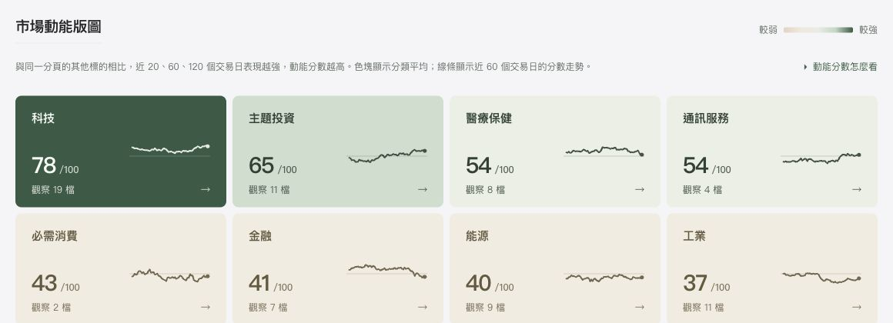

打開[市場動能儀表板](/zh-TW/momentum/)，先看哪些分類較強，再往下看個別 ETF。分類色塊上的分數，是該分類標的的**平均動能分數**；排行中的分數，才是**單一標的**的動能分數。兩者不能當成同一檔 ETF 的成績。

儀表板將美國上市 ETF 與少數其他上市商品分成「產業與主題」、「主要資產」、「市場結構」三份清單。行情會更新，以下以判讀方式為主；最新資料日期與數值請看儀表板。

## 從分類看到單一 ETF

### 第一步：選擇觀察範圍

「產業與主題」看科技、能源、金融、醫療與主題 ETF；「主要資產」看美股、海外市場、債券、商品等；「市場結構」看市值、等權重及不同選股策略。這三份清單**各自排名**，同樣是 70 分，不宜直接拿不同分頁的分數當成同一場比賽。

「選股策略（因子）」是依動量、品質、波動等特徵挑股票的 ETF；「成長股」則偏向成長特徵的股票。它們都是觀察清單的分類名稱，實際持股與規則仍以個別產品為準。

色塊分數越高，代表該分類在這份清單裡的近期相對動能越強；分數不是當天漲幅。圖片示範分類分數的讀法，實際畫面與數值以儀表板為準。

### 第二步：決定要看今天還是近期

選「單日漲跌」，分類色塊顯示內部標的**最近一個交易日漲跌幅的中位數**。例如 +1%，表示分類裡位於中間的漲跌幅約為 +1%；各檔標的仍可能有不同表現。下方標的也能依單日漲跌排序。

選「近期動能強弱」，分類色塊顯示所含標的的**平均動能分數**，右側小圖顯示這個分數近 60 個交易日的變化。所有小圖使用同一個 0–100 分刻度；你也可以點色塊，只看該分類的標的。

### 第三步：打開標的細節

下方排行可搜尋代碼或名稱，也可點欄位箭頭由高到低、由低到高排序。點開一檔 ETF，期間比較表會把近 20、60、120 個交易日的**標的報酬**、**SPY 同期報酬**及各期排名分數對齊。SPY 是追蹤標普 500 的 ETF，在這裡作為共同參考；債券、黃金等資產和 SPY 的風險不同，不應只靠兩者的報酬差做決定。

同一檔 ETF 可以今天下跌、近幾個月仍相對較強。單日漲跌和動能分數回答的是不同期間的問題，先確認期間，再比較標的。

## 動能分數如何算

動能分數先以調整後收盤價，計算標的與 SPY 在近 **20、60、120 個交易日**的報酬差。各期報酬差分別在**所選清單內**排名，再以 **20%／40%／40%** 加權，得到 0–100 分的相對分數。

標的明細中的「排名分數」分別對應這三段期間；把它們依上述權重合併，才得到排行上的動能分數。分類色塊再對該分類可計分的標的取平均。

因此，**80 分不是上漲 80%，也不是未來上漲機率 80%**；它描述的是觀察清單中的歷史相對位置。即使所有標的都下跌，跌得較少者仍可能排在前面。這也是為什麼看分數時，最好一起看期間報酬和資料日期。

這是本站選定的觀察清單，以 ETF 為主，也包含 DXYZ 等其他上市商品；部分標的出現在多個分頁。最新涵蓋數量可在儀表板的「觀察範圍」查看。上市時間不足或資料缺漏時，部分期間報酬或分數可能無法顯示。

## 免費版與 Pro 可看什麼

免費版能看**完整分類版圖**，並查看一組固定 ETF 的單日漲跌、動能分數與期間報酬。三個分頁各顯示屬於該清單的免費 ETF；它們不是依當天漲幅挑出的。最新免費名單與數量以儀表板為準。

Pro 可查看完整觀察清單的排行與明細。免費版也能搜尋其他標的的名稱，但其動能數值需升級後查看。兩個版本使用同一份最新收盤快照，差別在可看的**標的明細範圍**。

## 用動能建立自己的觀察順序

可以先問一個具體問題：高分是整個分類普遍較強，還是少數標的拉高平均？從版圖點進分類，逐檔比較單日漲跌和近 20、60、120 個交易日的表現。動能幫你找到值得再看的標的；是否納入自己的投資組合，仍要看持股內容、風險與投資期限。[前往市場動能儀表板](/zh-TW/momentum/)自行探索。
